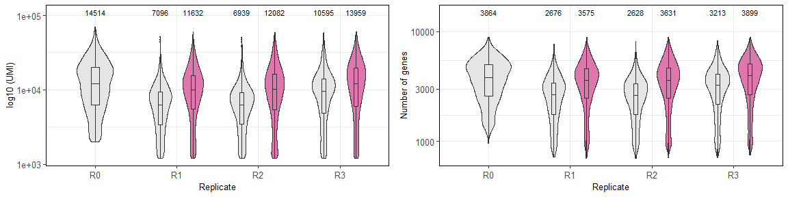

Metrics, metadata annotation and clustering
================

``` r
# Load resources. Libraries, paths, functions, themes.
source(file.path("..", "..", "scripts", "config.R"))
```

``` r
# Read merged dataset
merge_at_nema <- readRDS(ATH_DATA_PATH)
merge_os_nema <- readRDS(OSA_DATA_PATH)
```

``` r
# Assign metadata and factor levels for plots
merge_at_nema@meta.data <- merge_at_nema@meta.data %>%
  mutate(Replicate = case_when(
    orig.ident %in% c("MSS004", "MSS003") ~ "R1",
    orig.ident %in% c("MSS005", "MSS006") ~ "R2",
    orig.ident %in% c("MSS011", "MSS012") ~ "R3"
  )) %>%
  mutate(Treatment = case_when(
    orig.ident %in% c("MSS004", "MSS006", "MSS011") ~ "Mock",
    orig.ident %in% c("MSS003", "MSS005", "MSS012") ~ "Infected"
  )) %>%
  mutate(Treatment = fct_relevel(Treatment, c("Mock", "Infected"))) %>%
  mutate(Replicate = fct_relevel(Replicate, c("R1", "R2", "R3"))) %>%
  mutate(Cell_type = case_when(
    annotation.predicted == "Lateral root cap" ~ "LRC",
    annotation.predicted == "QC" ~ "SC",
    TRUE ~ annotation.predicted
  )) %>%
  mutate(Cell_type = fct_relevel(Cell_type, c(
    "Columella", "LRC", "SC", "Initials", "Epidermis", "Trichoblast",
    "Atrichoblast",
    "Cortex", "Endodermis", "Pericycle", "Procambium",
    "Phloem", "Xylem"
  )))

# Assign metadata and factor levels for plots
merge_os_nema@meta.data <- merge_os_nema@meta.data %>%
  mutate(Replicate = case_when(
    orig.ident %in% c("MSS007", "MSS008") ~ "R1",
    orig.ident %in% c("MSS009", "MSS010") ~ "R2",
    orig.ident %in% c("MSS013", "MSS014") ~ "R3",
    orig.ident == "MSS001" ~ "R0"
  )) %>%
  mutate(Replicate = fct_relevel(Replicate, c("R0", "R1", "R2", "R3"))) %>%
  mutate(Treatment = case_when(
    orig.ident %in% c(
      "MSS001", "MSS007", "MSS009",
      "MSS013"
    ) ~ "Mock",
    orig.ident %in% c(
      "MSS008", "MSS010",
      "MSS014"
    ) ~ "Infected"
  )) %>%
  mutate(Treatment = fct_relevel(Treatment, c("Mock", "Infected")))


ath_treat <- DimPlot(merge_at_nema,
  group.by = "Treatment",
  shuffle = TRUE, cols = cols_treat
)
osa_treat <- DimPlot(merge_os_nema,
  group.by = "Treatment",
  shuffle = TRUE, cols = cols_treat
)
grid.arrange(ath_treat, osa_treat, ncol = 2)
```

<!-- -->

### *Arabidopsis* metrics and clustering

#### Metrics

``` r
# Stats per replicate
at_stats <- merge_at_nema@meta.data %>%
  select(nCount_RNA, nFeature_RNA, Treatment, Replicate)

mean_umi <- at_stats %>%
  group_by(Treatment, Replicate) %>%
  summarise(mean = round(mean(nCount_RNA)))

plot_umi_at <- ggplot(at_stats, aes(x = Replicate, y = nCount_RNA, fill = Treatment)) +
  scale_y_continuous(trans = "log10") +
  geom_violin(linewidth = 0.2, position = position_dodge(width = 0.8), width = .6) +
  geom_boxplot(outlier.size = 0.2, linewidth = 0.1, width = .1, position = position_dodge(width = 0.8)) +
  geom_text(size = (4 * 10 / 14), data = mean_umi, aes(x = Replicate, fill = Treatment, label = mean, y = 110000, fill = NULL), position = position_dodge(width = .8)) +
  scale_fill_manual(values = cols_treat) +
  theme_notebook +
  ylab("log10 (UMI)")

mean_genes <- at_stats %>%
  group_by(Treatment, Replicate) %>%
  summarise(mean = round(mean(nFeature_RNA)))


plot_genes_at <- ggplot(at_stats, aes(x = Replicate, y = nFeature_RNA, fill = Treatment)) +
  scale_y_continuous(trans = "log10") +
  geom_violin(linewidth = 0.2, position = position_dodge(width = 0.8), width = .6) +
  geom_boxplot(outlier.size = 0.2, linewidth = 0.1, width = .1, position = position_dodge(width = 0.8)) +
  geom_text(size = (4 * 10 / 14), data = mean_genes, aes(x = Replicate, fill = Treatment, label = mean, y = 15000, fill = NULL), position = position_dodge(width = .8)) +
  scale_fill_manual(values = cols_treat) +
  theme_notebook +
  ylab("Number of genes")


grid.arrange(plot_umi_at, plot_genes_at, ncol = 2)
```

<!-- -->

#### Unsupervised clustering

``` r
merge_at_nema <- FindNeighbors(merge_at_nema, dims = 1:30, verbose = FALSE, reduction = "pca")
merge_at_nema <- FindClusters(merge_at_nema, graph.name = "SCT_snn", 
                              resolution = seq(0.1, 2, by = 0.1))
```

``` r
clustree(merge_at_nema, prefix = "SCT_snn_res.0.")
```

<!-- -->

Above resolution 0.8 the clusters are inestable, but below 0.8 the
clusters don’t separate correctly the cell type assigned with the
transfer label (see vascular tissues and columella). So, we have
selected resolution 0.8 for further analysis.

``` r
p1 <- DimPlot(merge_at_nema, group.by = "SCT_snn_res.0.7")
p2 <- DimPlot(merge_at_nema, group.by = "SCT_snn_res.0.8")
p3 <- DimPlot(merge_at_nema, group.by = "Cell_type")
grid.arrange(p1, p2, p3, ncol = 2)
```

<!-- -->

``` r
merge_at_nema@meta.data <- merge_at_nema@meta.data %>%
  mutate(Cluster = paste0("At", SCT_snn_res.0.8))
```

Now we calculate the differentially expressed markers for the clusters
with resolution 0.8

``` r
Idents(merge_at_nema) <- "Cluster"
ath_cluster_markers <- FindAllMarkers(merge_at_nema)
```

### Rice metrics and clustering

#### Metrics

``` r
# Stats per replicate
os_stats <- merge_os_nema@meta.data %>%
  select(nCount_RNA, nFeature_RNA, Treatment, Replicate)

mean_umi <- os_stats %>%
  group_by(Treatment, Replicate) %>%
  summarise(mean = round(mean(nCount_RNA)))

plot_umi_os <- ggplot(os_stats, aes(x = Replicate, y = nCount_RNA, 
                                    fill = Treatment)) +
  scale_y_continuous(trans = "log10") +
  geom_violin(linewidth = 0.2, position = position_dodge(width = 0.8, ), 
              width = .6) +
  geom_boxplot(outlier.size = 0.2, linewidth = 0.1, 
               width = .1, position = position_dodge(width = 0.8)) +
  geom_text(size = (4 * 10 / 14), 
            data = mean_umi, aes(x = Replicate, fill = Treatment, label = mean, 
                                 y = 110000, fill = NULL), 
            position = position_dodge(width = .8)) +
  scale_fill_manual(values = cols_treat) +
  theme_notebook +
  ylab("log10 (UMI)")


mean_genes <- os_stats %>%
  group_by(Treatment, Replicate) %>%
  summarise(mean = round(mean(nFeature_RNA)))


plot_genes_os <- ggplot(os_stats, aes(x = Replicate, y = nFeature_RNA, 
                                      fill = Treatment)) +
  scale_y_continuous(trans = "log10") +
  geom_violin(linewidth = 0.2, position = position_dodge(width = 0.8), width = .6) +
  geom_boxplot(outlier.size = 0.2, linewidth = 0.1, width = .1, 
               position = position_dodge(width = 0.8)) +
  geom_text(size = (4 * 10 / 14), data = mean_genes, 
            aes(x = Replicate, fill = Treatment, label = mean, 
                y = 15000, fill = NULL), 
            position = position_dodge(width = .8)) +
  scale_fill_manual(values = cols_treat) +
  theme_notebook +
  ylab("Number of genes")

grid.arrange(plot_umi_os, plot_genes_os, ncol = 2)
```

<!-- -->

#### Unsupervised clustering

``` r
merge_os_nema <- FindNeighbors(merge_os_nema, dims = 1:30, verbose = FALSE,reduction="pca")
merge_os_nema <-FindClusters(merge_os_nema, graph.name="SCT_snn",resolution=seq(0.1,2, by=0.1))
```

``` r
clustree(merge_os_nema,prefix = "SCT_snn_res.0.")
```

<!-- -->

``` r
merge_os_nema@meta.data <- merge_os_nema@meta.data %>% 
  mutate(Cluster=paste0("Os",SCT_snn_res.0.6))
```

Now we calculate the differentially expressed markers for the clusters
with resolution 0.6

``` r
Idents(merge_os_nema) <- "Cluster"
osa_cluster_markers <- FindAllMarkers(merge_os_nema)
```

``` r
sessionInfo()
```

    ## R version 4.2.1 (2022-06-23 ucrt)
    ## Platform: x86_64-w64-mingw32/x64 (64-bit)
    ## Running under: Windows 10 x64 (build 19045)
    ## 
    ## Matrix products: default
    ## 
    ## locale:
    ## [1] LC_COLLATE=Spanish_Spain.utf8  LC_CTYPE=Spanish_Spain.utf8   
    ## [3] LC_MONETARY=Spanish_Spain.utf8 LC_NUMERIC=C                  
    ## [5] LC_TIME=Spanish_Spain.utf8    
    ## 
    ## attached base packages:
    ##  [1] tools     stats4    grid      stats     graphics  grDevices utils    
    ##  [8] datasets  methods   base     
    ## 
    ## other attached packages:
    ##  [1] ggVennDiagram_1.5.2         igraph_2.0.1.1             
    ##  [3] muscatWrapper_1.0.0         xlsx_0.6.5                 
    ##  [5] edgeR_3.38.4                limma_3.52.4               
    ##  [7] SingleCellExperiment_1.18.1 muscat_1.10.1              
    ##  [9] ggpubr_0.6.0                corto_1.2.2                
    ## [11] ggh4x_0.2.8                 ggrepel_0.9.4              
    ## [13] rrvgo_1.8.0                 ontologyIndex_2.11         
    ## [15] pheatmap_1.0.12             ggsankey_0.0.99999         
    ## [17] future_1.33.0               ggthemes_4.2.4             
    ## [19] lubridate_1.9.3             dplyr_1.1.3                
    ## [21] purrr_1.0.2                 readr_2.1.2                
    ## [23] tidyr_1.3.1                 tibble_3.2.1               
    ## [25] tidyverse_2.0.0             scales_1.3.0               
    ## [27] RColorBrewer_1.1-3          rhdf5_2.40.0               
    ## [29] SummarizedExperiment_1.26.1 Biobase_2.56.0             
    ## [31] MatrixGenerics_1.8.1        Rcpp_1.0.11                
    ## [33] Matrix_1.6-1                GenomicRanges_1.48.0       
    ## [35] GenomeInfoDb_1.32.4         IRanges_2.30.1             
    ## [37] S4Vectors_0.34.0            BiocGenerics_0.44.0        
    ## [39] matrixStats_1.1.0           data.table_1.14.8          
    ## [41] stringr_1.5.1               plyr_1.8.9                 
    ## [43] magrittr_2.0.3              gtable_0.3.5               
    ## [45] ArchR_1.0.2                 gtools_3.9.4               
    ## [47] clustree_0.5.1              ggraph_2.1.0               
    ## [49] ggcorrplot_0.1.4.1          gridExtra_2.3              
    ## [51] patchwork_1.1.3             forcats_1.0.0              
    ## [53] rlang_1.1.2                 SeuratObject_5.0.0         
    ## [55] Seurat_4.4.0                ggplot2_3.4.4              
    ## 
    ## loaded via a namespace (and not attached):
    ##   [1] rsvd_1.0.5                ica_1.0-3                
    ##   [3] foreach_1.5.2             lmtest_0.9-40            
    ##   [5] crayon_1.5.2              rbibutils_2.2.16         
    ##   [7] MASS_7.3-58.1             rhdf5filters_1.8.0       
    ##   [9] nlme_3.1-159              backports_1.4.1          
    ##  [11] sva_3.46.0                GOSemSim_2.22.0          
    ##  [13] XVector_0.36.0            ROCR_1.0-11              
    ##  [15] irlba_2.3.5.1             nloptr_2.0.3             
    ##  [17] scater_1.26.1             BiocParallel_1.30.4      
    ##  [19] rjson_0.2.21              bit64_4.0.5              
    ##  [21] glue_1.6.2                sctransform_0.4.1        
    ##  [23] pbkrtest_0.5.2            parallel_4.2.1           
    ##  [25] vipor_0.4.5               spatstat.sparse_3.0-3    
    ##  [27] AnnotationDbi_1.60.0      dotCall64_1.1-0          
    ##  [29] spatstat.geom_3.2-7       tidyselect_1.2.0         
    ##  [31] fitdistrplus_1.1-11       variancePartition_1.28.0 
    ##  [33] XML_3.99-0.15             zoo_1.8-12               
    ##  [35] xtable_1.8-4              evaluate_0.23            
    ##  [37] Rdpack_2.6                scuttle_1.6.3            
    ##  [39] cli_3.6.1                 zlibbioc_1.42.0          
    ##  [41] rstudioapi_0.15.0         miniUI_0.1.1.1           
    ##  [43] sp_2.1-3                  aod_1.3.2                
    ##  [45] wordcloud_2.6             locfdr_1.1-8             
    ##  [47] shiny_1.8.0               BiocSingular_1.12.0      
    ##  [49] xfun_0.41                 tm_0.7-15                
    ##  [51] clue_0.3-65               cluster_2.1.4            
    ##  [53] caTools_1.18.2            tidygraph_1.3.0          
    ##  [55] KEGGREST_1.38.0           listenv_0.9.0            
    ##  [57] xlsxjars_0.6.1            Biostrings_2.64.1        
    ##  [59] png_0.1-8                 withr_3.0.1              
    ##  [61] bitops_1.0-7              slam_0.1-50              
    ##  [63] ggforce_0.4.1             dqrng_0.3.1              
    ##  [65] pillar_1.9.0              gplots_3.1.3             
    ##  [67] GlobalOptions_0.1.2       cachem_1.0.8             
    ##  [69] multcomp_1.4-25           NLP_0.3-2                
    ##  [71] GetoptLong_1.0.5          DelayedMatrixStats_1.20.0
    ##  [73] vctrs_0.6.4               ellipsis_0.3.2           
    ##  [75] generics_0.1.3            beeswarm_0.4.0           
    ##  [77] munsell_0.5.1             tweenr_2.0.2             
    ##  [79] emmeans_1.8.9             DelayedArray_0.22.0      
    ##  [81] fastmap_1.1.1             compiler_4.2.1           
    ##  [83] abind_1.4-5               httpuv_1.6.12            
    ##  [85] rJava_1.0-6               plotly_4.10.3            
    ##  [87] GenomeInfoDbData_1.2.9    glmmTMB_1.1.8            
    ##  [89] lattice_0.20-45           deldir_1.0-9             
    ##  [91] utf8_1.2.4                later_1.3.1              
    ##  [93] jsonlite_1.8.8            ScaledMatrix_1.6.0       
    ##  [95] pbapply_1.7-2             carData_3.0-5            
    ##  [97] sparseMatrixStats_1.8.0   estimability_1.4.1       
    ##  [99] genefilter_1.78.0         lazyeval_0.2.2           
    ## [101] promises_1.2.1            car_3.1-2                
    ## [103] doParallel_1.0.17         goftest_1.2-3            
    ## [105] checkmate_2.3.0           spatstat.utils_3.1-0     
    ## [107] reticulate_1.34.0         rmarkdown_2.25           
    ## [109] sandwich_3.0-2            cowplot_1.1.1            
    ## [111] blme_1.0-5                statmod_1.5.0            
    ## [113] Rtsne_0.16                uwot_0.1.16              
    ## [115] treemap_2.4-4             survival_3.4-0           
    ## [117] numDeriv_2016.8-1.1       yaml_2.3.7               
    ## [119] plotrix_3.8-4             htmltools_0.5.7          
    ## [121] memoise_2.0.1             locfit_1.5-9.8           
    ## [123] graphlayouts_1.1.0        viridisLite_0.4.2        
    ## [125] RhpcBLASctl_0.23-42       digest_0.6.33            
    ## [127] mime_0.12                 spam_2.10-0              
    ## [129] RSQLite_2.3.3             future.apply_1.11.0      
    ## [131] blob_1.2.4                labeling_0.4.3           
    ## [133] splines_4.2.1             Rhdf5lib_1.18.2          
    ## [135] RCurl_1.98-1.13           broom_1.0.5              
    ## [137] hms_1.1.3                 colorspace_2.1-0         
    ## [139] ggbeeswarm_0.7.2          shape_1.4.6              
    ## [141] RANN_2.6.1                mvtnorm_1.2-3            
    ## [143] circlize_0.4.15           fansi_1.0.5              
    ## [145] tzdb_0.3.0                parallelly_1.36.0        
    ## [147] R6_2.5.1                  ggridges_0.5.4           
    ## [149] lifecycle_1.0.4           bluster_1.8.0            
    ## [151] ggsignif_0.6.4            minqa_1.2.6              
    ## [153] leiden_0.4.3              RcppAnnoy_0.0.21         
    ## [155] TH.data_1.1-2             iterators_1.0.14         
    ## [157] spatstat.explore_3.2-5    TMB_1.9.6                
    ## [159] htmlwidgets_1.6.2         beachmat_2.12.0          
    ## [161] polyclip_1.10-6           timechange_0.2.0         
    ## [163] ComplexHeatmap_2.14.0     mgcv_1.8-40              
    ## [165] globals_0.16.2            spatstat.random_3.2-1    
    ## [167] progressr_0.14.0          codetools_0.2-18         
    ## [169] metapod_1.6.0             GO.db_3.15.0             
    ## [171] prettyunits_1.2.0         gridBase_0.4-7           
    ## [173] DBI_1.1.3                 highr_0.10               
    ## [175] tensor_1.5                httr_1.4.7               
    ## [177] KernSmooth_2.23-20        stringi_1.8.1            
    ## [179] progress_1.2.3            reshape2_1.4.4           
    ## [181] farver_2.1.1              annotate_1.76.0          
    ## [183] viridis_0.6.5             xml2_1.3.5               
    ## [185] boot_1.3-28               BiocNeighbors_1.14.0     
    ## [187] lme4_1.1-35.1             geneplotter_1.76.0       
    ## [189] scattermore_1.2           scran_1.26.0             
    ## [191] DESeq2_1.36.0             bit_4.0.5                
    ## [193] spatstat.data_3.0-3       pkgconfig_2.0.3          
    ## [195] lmerTest_3.1-3            rstatix_0.7.2            
    ## [197] knitr_1.45
