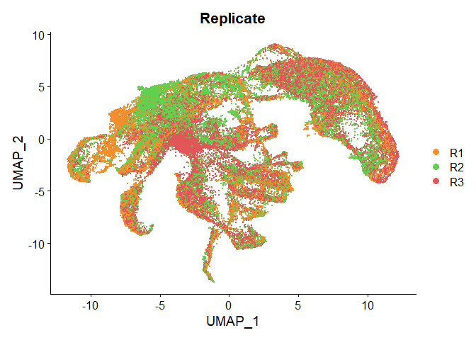
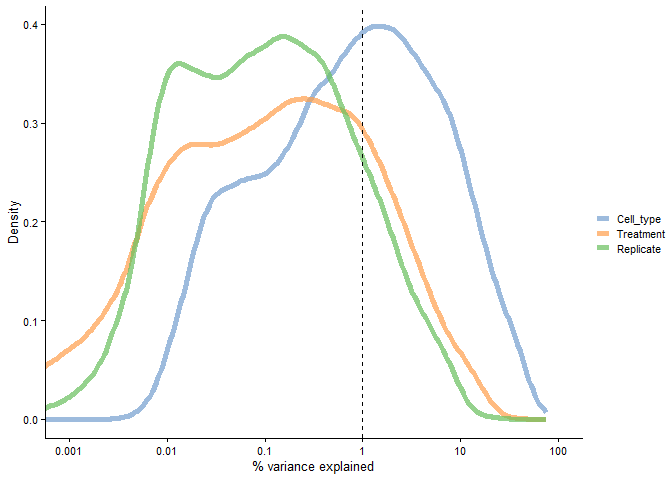
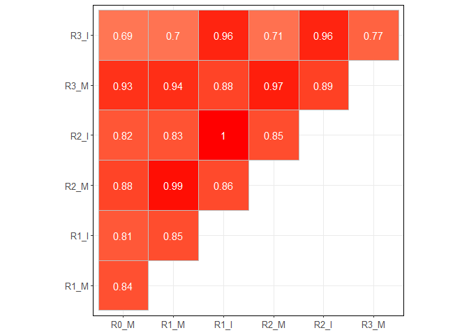
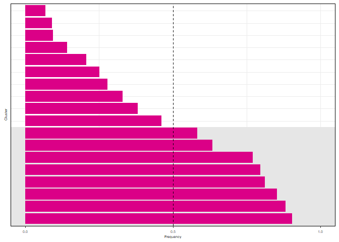
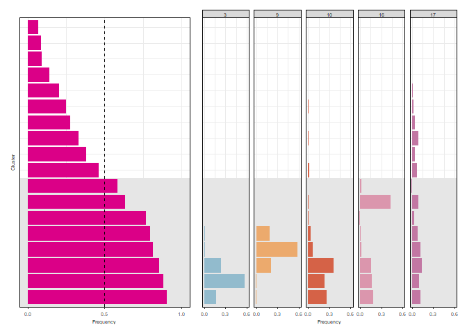

Batch effect and sample size evaluation
================

``` r
# Load resources. Libraries, paths, functions, themes.
source(file.path("..", "..", "scripts", "config.R"))
set.seed(101)
```

``` r
# Read merged dataset
merge_at_nema <- readRDS(ATH_DATA_PATH)
merge_os_nema <- readRDS(OSA_DATA_PATH)
```

# Effect in the clustering by replicate

``` r
DimPlot(merge_at_nema, group.by = "Replicate",shuffle = TRUE)+
  scale_color_manual(values=cols_rep)
```

<!-- -->

``` r
DimPlot(merge_os_nema, group.by = "Replicate",shuffle = TRUE)+
  scale_color_manual(values=cols_rep_r0)
```

<!-- -->

``` r
ggplot(merge_at_nema@meta.data, aes(x=Cluster, fill=Replicate))+
  geom_bar(position = "fill")+
  scale_fill_manual(values=cols_rep)
```

<!-- -->

``` r
ggplot(merge_os_nema@meta.data, aes(x=Cluster, fill=Replicate))+
  geom_bar(position = "fill")+
  scale_fill_manual(values=cols_rep_r0)
```

<!-- -->

``` r
at_sc <- as.SingleCellExperiment(merge_at_nema, assay = "SCT")

vars_ath <- c("Replicate","Treatment","annotation.predicted")
scater::plotExplanatoryVariables(
  at_sc, variables = vars_ath,exprs_values = "logcounts"
)
```

    ## Warning: Removed 57 rows containing non-finite values (`stat_density()`).

<!-- -->

``` r
os_sc <- as.SingleCellExperiment(merge_os_nema, assay = "SCT")

vars_osa <- c("Replicate","Treatment","Cell_type")
scater::plotExplanatoryVariables(
  os_sc, variables = vars_osa,exprs_values = "logcounts"
)
```

<!-- -->

``` r
ath_pca_emb <- Embeddings(object = merge_at_nema[["pca"]])[, 1:2]%>% 
  cbind(merge_at_nema@meta.data)
ggplot(ath_pca_emb, aes(x=Replicate, y=PC_1, fill=Replicate))+
  geom_violin(linewidth=0.05,width=.6)+
  geom_boxplot(outlier.size=0,linewidth=0.05,width=.1,outlier.shape = NA)+
  scale_fill_manual(values= cols_rep)+
  facet_grid(cols=vars(Treatment))+
  theme_notebook+
  theme(panel.spacing = unit(0.1, "lines"),
        strip.background = element_rect(fill = "white", color = "black"),
        strip.text = element_text(margin = margin(2, 0, 2, 0)))+
  ylab("Embedding values (PC 1)")
```

<!-- -->

``` r
osa_pca_emb <- Embeddings(object = merge_os_nema[["pca"]])[, 1:2]%>% 
  cbind(merge_os_nema@meta.data)
ggplot(osa_pca_emb, aes(x=Replicate, y=PC_1, fill=Replicate))+
  geom_violin(linewidth=0.05,width=.6)+
  geom_boxplot(outlier.size=0,linewidth=0.05,width=.1,outlier.shape = NA)+
  scale_fill_manual(values= cols_rep_r0)+
  facet_grid(cols=vars(Treatment))+
  theme_notebook+
  theme(panel.spacing = unit(0.1, "lines"),
        strip.background = element_rect(fill = "white", color = "black"),
        strip.text = element_text(margin = margin(2, 0, 2, 0)))+
  ylab("Embedding values (PC 1)")
```

<!-- -->

``` r
#Perform correlation between samples
osa_rep_agg <- AggregateExpression(
  merge_os_nema,
  assays = "RNA",
  return.seurat = FALSE,
  group.by = c("Replicate","Treatment"),
  add.ident = NULL,
  slot = "counts"
)

cor_matrix <- cor((osa_rep_agg[[1]]), method = "pearson")
rownames(cor_matrix)<-c("R0_M","R1_M","R1_I","R2_M","R2_I","R3_M","R3_I")
colnames(cor_matrix)<-c("R0_M","R1_M","R1_I","R2_M","R2_I","R3_M","R3_I")

osa_corr_plot <- ggcorrplot(cor_matrix,
           lab_col = "white",
           type = "upper",
           lab = T,
           show.diag = F)+theme_notebook+ 
  theme(axis.title=element_blank(), legend.position = "none")
osa_corr_plot
```

<!-- -->

``` r
# Perform correlation between samples
ath_rep_agg <- AggregateExpression(
  merge_at_nema,
  assays = "RNA",
  return.seurat = FALSE,
  group.by = c("Replicate", "Treatment"),
  add.ident = NULL,
  slot = "counts"
)

cor_matrix <- cor((ath_rep_agg[[1]]), method = "pearson")
rownames(cor_matrix) <- c("R1_M", "R1_I", "R2_M", "R2_I", "R3_M", "R3_I")
colnames(cor_matrix) <- c("R1_M", "R1_I", "R2_M", "R2_I", "R3_M", "R3_I")

ath_corr_plot <- ggcorrplot(cor_matrix,
  lab_col = "white",
  type = "upper",
  lab = T,
  show.diag = F
) + theme_notebook + theme(axis.title = element_blank(), legend.position = "none")
ath_corr_plot
```

<!-- -->

# Effect in the clustering by sample size

``` r
#Apply subsampling to Arabidopsis dataset
variable<-"Treatment"
clusters <- "SCT_snn_res.0.8"

set.seed(100)
at_subsampling_15 <- SubsampleSeurat(merge_at_nema,variable,clusters,nclusters = 15)
#saveRDS(at_subsampling_15, file.path("..", "Resources","02_Subsampling","at_subsampling_15.rds"))

#Apply subsampling to rice dataset

variable<-"Treatment"
clusters <- "SCT_snn_res.0.6"

set.seed(100)
os_subsampling_15 <- SubsampleSeurat(merge_os_nema,variable,clusters,nclusters = 15)
#saveRDS(os_subsampling_15, file.path("..", "Resources","02_Subsampling","os_subsampling_15.rds"))
```

## Exploration of clustering after subsampling

### *Arabidopsis thaliana*

We have generated a list with the data of the ten repetitions of
subsampling and clustering. Every repetition contains the dataset with
the cells randomly selected (10K from mock and 10K from infected) and
the number of the new cluster assigned (new_cluster) and the number of
the original cluster in the dataset (ref_cluster).

``` r
str(at_subsampling_15)
```

    ## List of 10
    ##  $ :'data.frame':    20000 obs. of  3 variables:
    ##   ..$ new_cluster: Factor w/ 17 levels "0","1","2","3",..: 7 2 1 8 7 11 5 1 6 2 ...
    ##   ..$ Treatment  : Factor w/ 2 levels "Mock","Infected": 1 1 1 1 1 1 1 1 1 1 ...
    ##   ..$ ref_cluster: Factor w/ 29 levels "0","1","2","3",..: 8 15 6 2 20 4 29 6 1 7 ...
    ##  $ :'data.frame':    20000 obs. of  3 variables:
    ##   ..$ new_cluster: Factor w/ 15 levels "0","1","2","3",..: 2 2 15 4 7 2 9 11 6 7 ...
    ##   ..$ Treatment  : Factor w/ 2 levels "Mock","Infected": 1 1 1 1 1 1 1 1 1 1 ...
    ##   ..$ ref_cluster: Factor w/ 29 levels "0","1","2","3",..: 14 7 27 3 20 15 2 11 4 20 ...
    ##  $ :'data.frame':    20000 obs. of  3 variables:
    ##   ..$ new_cluster: Factor w/ 17 levels "0","1","2","3",..: 3 1 4 14 8 12 16 2 7 3 ...
    ##   ..$ Treatment  : Factor w/ 2 levels "Mock","Infected": 1 1 1 1 1 1 1 1 1 1 ...
    ##   ..$ ref_cluster: Factor w/ 29 levels "0","1","2","3",..: 10 22 1 17 5 23 18 1 19 3 ...
    ##  $ :'data.frame':    20000 obs. of  3 variables:
    ##   ..$ new_cluster: Factor w/ 16 levels "0","1","2","3",..: 7 9 9 3 13 1 11 2 4 3 ...
    ##   ..$ Treatment  : Factor w/ 2 levels "Mock","Infected": 1 1 1 1 1 1 1 1 1 1 ...
    ##   ..$ ref_cluster: Factor w/ 29 levels "0","1","2","3",..: 2 17 17 6 14 1 4 7 3 6 ...
    ##  $ :'data.frame':    20000 obs. of  3 variables:
    ##   ..$ new_cluster: Factor w/ 16 levels "0","1","2","3",..: 4 6 2 2 1 11 2 10 10 3 ...
    ##   ..$ Treatment  : Factor w/ 2 levels "Mock","Infected": 1 1 1 1 1 1 1 1 1 1 ...
    ##   ..$ ref_cluster: Factor w/ 29 levels "0","1","2","3",..: 1 2 13 6 12 14 6 4 4 29 ...
    ##  $ :'data.frame':    20000 obs. of  3 variables:
    ##   ..$ new_cluster: Factor w/ 17 levels "0","1","2","3",..: 13 6 17 8 11 5 1 2 15 12 ...
    ##   ..$ Treatment  : Factor w/ 2 levels "Mock","Infected": 1 1 1 1 1 1 1 1 1 1 ...
    ##   ..$ ref_cluster: Factor w/ 29 levels "0","1","2","3",..: 11 19 14 5 1 14 22 10 10 13 ...
    ##  $ :'data.frame':    20000 obs. of  3 variables:
    ##   ..$ new_cluster: Factor w/ 16 levels "0","1","2","3",..: 1 2 9 8 7 1 5 15 13 5 ...
    ##   ..$ Treatment  : Factor w/ 2 levels "Mock","Infected": 1 1 1 1 1 1 1 1 1 1 ...
    ##   ..$ ref_cluster: Factor w/ 29 levels "0","1","2","3",..: 1 16 27 12 2 1 3 18 11 3 ...
    ##  $ :'data.frame':    20000 obs. of  3 variables:
    ##   ..$ new_cluster: Factor w/ 17 levels "0","1","2","3",..: 4 5 1 6 1 7 1 1 1 11 ...
    ##   ..$ Treatment  : Factor w/ 2 levels "Mock","Infected": 1 1 1 1 1 1 1 1 1 1 ...
    ##   ..$ ref_cluster: Factor w/ 29 levels "0","1","2","3",..: 13 9 16 11 7 2 7 7 8 10 ...
    ##  $ :'data.frame':    20000 obs. of  3 variables:
    ##   ..$ new_cluster: Factor w/ 16 levels "0","1","2","3",..: 3 14 1 4 1 15 9 7 2 14 ...
    ##   ..$ Treatment  : Factor w/ 2 levels "Mock","Infected": 1 1 1 1 1 1 1 1 1 1 ...
    ##   ..$ ref_cluster: Factor w/ 29 levels "0","1","2","3",..: 13 18 8 3 4 21 18 14 10 18 ...
    ##  $ :'data.frame':    20000 obs. of  3 variables:
    ##   ..$ new_cluster: Factor w/ 17 levels "0","1","2","3",..: 5 13 5 2 2 13 7 13 14 1 ...
    ##   ..$ Treatment  : Factor w/ 2 levels "Mock","Infected": 1 1 1 1 1 1 1 1 1 1 ...
    ##   ..$ ref_cluster: Factor w/ 29 levels "0","1","2","3",..: 9 14 16 1 1 14 2 27 11 22 ...

``` r
head(at_subsampling_15[[1]])
```

    ##                      new_cluster Treatment ref_cluster
    ## GGCAGTCAGTTTGCTG-1_3           6      Mock           7
    ## CTCATGCGTCAGACGA-1_1           1      Mock          14
    ## GTGCAGCTCGCCACTT-1_5           0      Mock           5
    ## AGATAGACAACGAGGT-1_5           7      Mock           1
    ## ATCCGTCGTAATGTGA-1_3           6      Mock          19
    ## CACGAATCAAACTAAG-1_5          10      Mock           3

Then, we calculate for every bootstrap repetition the frequency of
infected and mock cells in every of the new clusters and we rename the
clusters depending on the frequency of infected cells.

``` r
cluster_sort_frequency <- map(at_subsampling_15, ~group_by(.x,new_cluster,Treatment) %>% 
         summarise(n = n()) %>%
         mutate(freq = n / sum(n)) %>% 
         ungroup() %>% 
         arrange(Treatment,freq) %>%              
         mutate(new_cluster = factor(new_cluster, unique(new_cluster))) %>% 
         mutate(new_cluster_order = factor(c(0:(length(unique(new_cluster))-1),(length(unique(new_cluster))-1):0))))
```

We obtain a list were the new clusters are renamed depending the
frequency of Mock and Infected frequency cells. This allow us to compare
clusters within the bootstrap repetitions.

``` r
head(cluster_sort_frequency[[1]])
```

    ## # A tibble: 6 × 5
    ##   new_cluster Treatment     n  freq new_cluster_order
    ##   <fct>       <fct>     <int> <dbl> <fct>            
    ## 1 2           Mock        339 0.182 0                
    ## 2 4           Mock        401 0.230 1                
    ## 3 3           Mock        695 0.376 2                
    ## 4 5           Mock        664 0.404 3                
    ## 5 8           Mock        597 0.522 4                
    ## 6 6           Mock        835 0.533 5

We calculate the mean frequency of the equivalent clusters in all the
bootstraps repetitions.

``` r
cluster_sort_frequency_summary <- do.call(rbind,cluster_sort_frequency) %>% 
  group_by(new_cluster_order,Treatment) %>% 
  summarise(mean=mean(freq),
            sem=sd(freq)) %>% 
  filter(Treatment=="Infected")
```

    ## `summarise()` has grouped output by 'new_cluster_order'. You can override using
    ## the `.groups` argument.

``` r
head(cluster_sort_frequency_summary)
```

    ## # A tibble: 6 × 4
    ## # Groups:   new_cluster_order [6]
    ##   new_cluster_order Treatment  mean    sem
    ##   <fct>             <fct>     <dbl>  <dbl>
    ## 1 0                 Infected  0.857 0.0576
    ## 2 1                 Infected  0.746 0.0408
    ## 3 2                 Infected  0.649 0.0373
    ## 4 3                 Infected  0.599 0.0409
    ## 5 4                 Infected  0.540 0.0496
    ## 6 5                 Infected  0.503 0.0294

``` r
plot_freq <- ggplot(data=cluster_sort_frequency_summary, aes(x=new_cluster_order,y=mean,fill=Treatment)) +
  geom_rect(xmin=0,xmax=4.5, ymin=-Inf, ymax=Inf,alpha=0.3,fill="grey90")+
  geom_bar(stat="identity")+
  scale_fill_manual(values="#db0087")+
  geom_hline(yintercept=0.5,linetype = "dashed",linewidth=0.1)+
  ylab("Frequency")+
  theme_paper+
  xlab("Cluster")+
  theme(axis.text.y=element_blank(),
        axis.ticks.y=element_blank())+
  scale_y_continuous(breaks=c(0,0.5,1), limits=c(0,1))+
  coord_flip()

plot_freq
```

<!-- -->

Now we check if the cells from the selected “nematode clusters” are
assigned to the new clusters enriched in cells from Infected samples
after subsampling.

``` r
old_cells_list <- lapply(1:10, function(i) {
  new_order <- cluster_sort_frequency[[i]] %>% distinct(new_cluster,new_cluster_order)
  
  data_old_cells <- at_subsampling_15[[i]] %>% 
    mutate(new_cluster = factor(new_cluster, levels(cluster_sort_frequency[[i]]$new_cluster))) %>% 
    group_by(new_cluster,ref_cluster) %>% 
    summarise(n=n()) %>% 
    ungroup() %>% 
    group_by(ref_cluster) %>% 
    mutate(freq = n / sum(n)) %>% 
    ungroup() %>% 
    complete(new_cluster,ref_cluster) %>% 
    filter(ref_cluster %in% c(8,28)) %>% 
    left_join(new_order,by="new_cluster") %>% 
    mutate(freq=case_when(is.na(freq) ~ 0,
                          TRUE ~ freq)) %>% 
    mutate(subsampling = i)
  
  return(data_old_cells)
})

data_density<-bind_rows(old_cells_list) %>% 
  group_by(ref_cluster,new_cluster_order) %>% 
  summarise(mean_freq=mean(freq))


plot_ref_clusters <- ggplot(data=data_density, aes(x=new_cluster_order,y=mean_freq,fill=ref_cluster)) +
  geom_rect(xmin=0,xmax=4.5, ymin=-Inf, ymax=Inf,alpha=0.3,fill="grey90")+
  geom_bar(stat="identity")+
  scale_fill_manual(values=cols_umap[c(9,29)])+
  facet_grid(cols=vars(ref_cluster))+
  ylab("Frequency")+
  theme_strip+
  xlab(NULL)+
  theme(axis.title.y=element_blank(),
        axis.text.y=element_blank(),
        axis.ticks.y=element_blank())+
  scale_y_continuous(breaks=c(0,0.3,0.6), limits=c(0,0.6))+
  coord_flip()
```

``` r
plot_at_subsampling <- plot_freq +plot_ref_clusters+plot_layout(widths = c(1,1.5))
```

``` r
plot_at_subsampling 
```

<!-- -->

### *Oryza sativa*

We repeat the same with the rice dataset

``` r
head(os_subsampling_15[[1]])
```

    ##                      new_cluster Treatment ref_cluster
    ## TGACGCGGTACATACC-1             8      Mock          21
    ## CTTCGGTCACCTAAAC-1             2      Mock           1
    ## AACGAAACACTGAGTT-1_3           7      Mock           3
    ## ACCTACCCAATAGTAG-1_3           3      Mock           7
    ## TGGAGGAAGTGGAAGA-1             3      Mock           7
    ## TGTAGACCATTGCAAC-1_1           1      Mock           5

Then, we calculate for every bootstrap repetition the frequency of
infected and mock cells in every of the new clusters and we rename the
clusters depending on the frequency of infected cells.

``` r
cluster_sort_frequency <- map(os_subsampling_15, ~group_by(.x,new_cluster,Treatment) %>% 
         summarise(n = n()) %>%
         mutate(freq = n / sum(n)) %>% 
         ungroup() %>% 
         arrange(Treatment,freq) %>%              
         mutate(new_cluster = factor(new_cluster, unique(new_cluster))) %>% 
         mutate(new_cluster_order = factor(c(0:(length(unique(new_cluster))-1),(length(unique(new_cluster))-1):0))))
```

``` r
head(cluster_sort_frequency[[1]])
```

    ## # A tibble: 6 × 5
    ##   new_cluster Treatment     n   freq new_cluster_order
    ##   <fct>       <fct>     <int>  <dbl> <fct>            
    ## 1 10          Mock         50 0.0729 0                
    ## 2 4           Mock        189 0.124  1                
    ## 3 7           Mock        164 0.130  2                
    ## 4 8           Mock        190 0.176  3                
    ## 5 11          Mock        142 0.209  4                
    ## 6 5           Mock        330 0.222  5

``` r
cluster_sort_frequency_summary <- do.call(rbind,cluster_sort_frequency) %>% 
  group_by(new_cluster_order,Treatment) %>% 
  summarise(mean=mean(freq),
            sem=sd(freq)) %>% 
  filter(Treatment=="Infected")
```

    ## `summarise()` has grouped output by 'new_cluster_order'. You can override using
    ## the `.groups` argument.

``` r
head(cluster_sort_frequency_summary)
```

    ## # A tibble: 6 × 4
    ## # Groups:   new_cluster_order [6]
    ##   new_cluster_order Treatment  mean    sem
    ##   <fct>             <fct>     <dbl>  <dbl>
    ## 1 0                 Infected  0.904 0.0178
    ## 2 1                 Infected  0.882 0.0112
    ## 3 2                 Infected  0.853 0.0224
    ## 4 3                 Infected  0.812 0.0102
    ## 5 4                 Infected  0.797 0.0120
    ## 6 5                 Infected  0.770 0.0315

``` r
plot_freq <- ggplot(data=cluster_sort_frequency_summary, aes(x=new_cluster_order,y=mean,fill=Treatment)) +
  geom_rect(xmin=0,xmax=8.5, ymin=-Inf, ymax=Inf,alpha=0.3,fill="grey90")+
  geom_bar(stat="identity")+
  scale_fill_manual(values="#db0087")+
  geom_hline(yintercept=0.5,linetype = "dashed",linewidth=0.1)+
  ylab("Frequency")+
  theme_paper+
  xlab("Cluster")+
  theme(axis.text.y=element_blank(),
        axis.ticks.y=element_blank())+
  scale_y_continuous(breaks=c(0,0.5,1), limits=c(0,1))+
  coord_flip()

plot_freq
```

<!-- -->

``` r
old_cells_list <- lapply(1:10, function(i) {
  new_order <- cluster_sort_frequency[[i]] %>% distinct(new_cluster,new_cluster_order)
  
  data_old_cells <- os_subsampling_15[[i]] %>% 
    mutate(new_cluster = factor(new_cluster, levels(cluster_sort_frequency[[i]]$new_cluster))) %>% 
    group_by(new_cluster,ref_cluster) %>% 
    summarise(n=n()) %>% 
    ungroup() %>% 
    group_by(ref_cluster) %>% 
    mutate(freq = n / sum(n)) %>% 
    ungroup() %>% 
    complete(new_cluster,ref_cluster) %>% 
    filter(ref_cluster %in% c(3,9,10,16,17)) %>% 
    left_join(new_order,by="new_cluster") %>% 
    mutate(freq=case_when(is.na(freq) ~ 0,
                          TRUE ~ freq)) %>% 
    mutate(subsampling = i)
  
  return(data_old_cells)
})

data_density<-bind_rows(old_cells_list) %>% 
  group_by(ref_cluster,new_cluster_order) %>% 
  summarise(mean_freq=mean(freq))


plot_ref_clusters <- ggplot(data=data_density, aes(x=new_cluster_order,y=mean_freq,fill=ref_cluster)) +
  geom_rect(xmin=0,xmax=8.5, ymin=-Inf, ymax=Inf,alpha=0.3,fill="grey90")+
  geom_bar(stat="identity")+
  scale_fill_manual(values=cols_umap[c(4,10,11,17,18)])+
  facet_grid(cols=vars(ref_cluster))+
  ylab("Frequency")+
  theme_strip+
  xlab(NULL)+
  theme(axis.title.y=element_blank(),
        axis.text.y=element_blank(),
        axis.ticks.y=element_blank())+
  scale_y_continuous(breaks=c(0,0.3,0.6), limits=c(0,0.6))+
  coord_flip()
```

``` r
plot_os_subsampling <- plot_freq +plot_ref_clusters+plot_layout(widths = c(1,1.5))
```

``` r
plot_os_subsampling 
```

<!-- -->

``` r
sessionInfo()
```

    ## R version 4.2.1 (2022-06-23 ucrt)
    ## Platform: x86_64-w64-mingw32/x64 (64-bit)
    ## Running under: Windows 10 x64 (build 19045)
    ## 
    ## Matrix products: default
    ## 
    ## locale:
    ## [1] LC_COLLATE=Spanish_Spain.utf8  LC_CTYPE=Spanish_Spain.utf8   
    ## [3] LC_MONETARY=Spanish_Spain.utf8 LC_NUMERIC=C                  
    ## [5] LC_TIME=Spanish_Spain.utf8    
    ## 
    ## attached base packages:
    ##  [1] tools     stats4    grid      stats     graphics  grDevices utils    
    ##  [8] datasets  methods   base     
    ## 
    ## other attached packages:
    ##  [1] lisi_1.0                    harmony_1.1.0              
    ##  [3] scater_1.26.1               scuttle_1.6.3              
    ##  [5] ggVennDiagram_1.5.2         igraph_2.0.1.1             
    ##  [7] muscatWrapper_1.0.0         xlsx_0.6.5                 
    ##  [9] edgeR_3.38.4                limma_3.52.4               
    ## [11] SingleCellExperiment_1.18.1 muscat_1.10.1              
    ## [13] ggpubr_0.6.0                corto_1.2.2                
    ## [15] ggh4x_0.2.8                 ggrepel_0.9.4              
    ## [17] rrvgo_1.8.0                 ontologyIndex_2.11         
    ## [19] pheatmap_1.0.12             ggsankey_0.0.99999         
    ## [21] future_1.33.0               ggthemes_4.2.4             
    ## [23] lubridate_1.9.3             dplyr_1.1.3                
    ## [25] purrr_1.0.2                 readr_2.1.2                
    ## [27] tidyr_1.3.1                 tibble_3.2.1               
    ## [29] tidyverse_2.0.0             scales_1.3.0               
    ## [31] RColorBrewer_1.1-3          rhdf5_2.40.0               
    ## [33] SummarizedExperiment_1.26.1 Biobase_2.56.0             
    ## [35] MatrixGenerics_1.8.1        Rcpp_1.0.11                
    ## [37] Matrix_1.6-1                GenomicRanges_1.48.0       
    ## [39] GenomeInfoDb_1.32.4         IRanges_2.30.1             
    ## [41] S4Vectors_0.34.0            BiocGenerics_0.44.0        
    ## [43] matrixStats_1.1.0           data.table_1.14.8          
    ## [45] stringr_1.5.1               plyr_1.8.9                 
    ## [47] magrittr_2.0.3              gtable_0.3.5               
    ## [49] ArchR_1.0.2                 gtools_3.9.4               
    ## [51] clustree_0.5.1              ggraph_2.1.0               
    ## [53] ggcorrplot_0.1.4.1          gridExtra_2.3              
    ## [55] patchwork_1.1.3             forcats_1.0.0              
    ## [57] rlang_1.1.2                 SeuratObject_5.0.0         
    ## [59] Seurat_4.4.0                ggplot2_3.4.4              
    ## 
    ## loaded via a namespace (and not attached):
    ##   [1] rsvd_1.0.5                ica_1.0-3                
    ##   [3] foreach_1.5.2             lmtest_0.9-40            
    ##   [5] crayon_1.5.2              rbibutils_2.2.16         
    ##   [7] MASS_7.3-58.1             rhdf5filters_1.8.0       
    ##   [9] nlme_3.1-159              backports_1.4.1          
    ##  [11] sva_3.46.0                GOSemSim_2.22.0          
    ##  [13] XVector_0.36.0            ROCR_1.0-11              
    ##  [15] irlba_2.3.5.1             nloptr_2.0.3             
    ##  [17] BiocParallel_1.30.4       rjson_0.2.21             
    ##  [19] bit64_4.0.5               glue_1.6.2               
    ##  [21] sctransform_0.4.1         pbkrtest_0.5.2           
    ##  [23] parallel_4.2.1            vipor_0.4.5              
    ##  [25] spatstat.sparse_3.0-3     AnnotationDbi_1.60.0     
    ##  [27] dotCall64_1.1-0           spatstat.geom_3.2-7      
    ##  [29] tidyselect_1.2.0          fitdistrplus_1.1-11      
    ##  [31] variancePartition_1.28.0  XML_3.99-0.15            
    ##  [33] zoo_1.8-12                xtable_1.8-4             
    ##  [35] evaluate_0.23             Rdpack_2.6               
    ##  [37] cli_3.6.1                 zlibbioc_1.42.0          
    ##  [39] rstudioapi_0.15.0         miniUI_0.1.1.1           
    ##  [41] sp_2.1-3                  aod_1.3.2                
    ##  [43] wordcloud_2.6             locfdr_1.1-8             
    ##  [45] shiny_1.8.0               BiocSingular_1.12.0      
    ##  [47] xfun_0.41                 tm_0.7-15                
    ##  [49] clue_0.3-65               cluster_2.1.4            
    ##  [51] caTools_1.18.2            tidygraph_1.3.0          
    ##  [53] KEGGREST_1.38.0           listenv_0.9.0            
    ##  [55] xlsxjars_0.6.1            Biostrings_2.64.1        
    ##  [57] png_0.1-8                 withr_3.0.1              
    ##  [59] bitops_1.0-7              slam_0.1-50              
    ##  [61] ggforce_0.4.1             dqrng_0.3.1              
    ##  [63] pillar_1.9.0              gplots_3.1.3             
    ##  [65] GlobalOptions_0.1.2       cachem_1.0.8             
    ##  [67] multcomp_1.4-25           NLP_0.3-2                
    ##  [69] GetoptLong_1.0.5          DelayedMatrixStats_1.20.0
    ##  [71] vctrs_0.6.4               ellipsis_0.3.2           
    ##  [73] generics_0.1.3            beeswarm_0.4.0           
    ##  [75] munsell_0.5.1             tweenr_2.0.2             
    ##  [77] emmeans_1.8.9             DelayedArray_0.22.0      
    ##  [79] fastmap_1.1.1             compiler_4.2.1           
    ##  [81] abind_1.4-5               httpuv_1.6.12            
    ##  [83] rJava_1.0-6               plotly_4.10.3            
    ##  [85] GenomeInfoDbData_1.2.9    glmmTMB_1.1.8            
    ##  [87] lattice_0.20-45           deldir_1.0-9             
    ##  [89] utf8_1.2.4                later_1.3.1              
    ##  [91] jsonlite_1.8.8            ScaledMatrix_1.6.0       
    ##  [93] pbapply_1.7-2             carData_3.0-5            
    ##  [95] sparseMatrixStats_1.8.0   estimability_1.4.1       
    ##  [97] genefilter_1.78.0         lazyeval_0.2.2           
    ##  [99] promises_1.2.1            car_3.1-2                
    ## [101] doParallel_1.0.17         goftest_1.2-3            
    ## [103] spatstat.utils_3.1-0      reticulate_1.34.0        
    ## [105] rmarkdown_2.25            sandwich_3.0-2           
    ## [107] cowplot_1.1.1             blme_1.0-5               
    ## [109] statmod_1.5.0             Rtsne_0.16               
    ## [111] uwot_0.1.16               treemap_2.4-4            
    ## [113] survival_3.4-0            numDeriv_2016.8-1.1      
    ## [115] yaml_2.3.7                plotrix_3.8-4            
    ## [117] htmltools_0.5.7           memoise_2.0.1            
    ## [119] locfit_1.5-9.8            graphlayouts_1.1.0       
    ## [121] viridisLite_0.4.2         RhpcBLASctl_0.23-42      
    ## [123] digest_0.6.33             mime_0.12                
    ## [125] spam_2.10-0               RSQLite_2.3.3            
    ## [127] future.apply_1.11.0       blob_1.2.4               
    ## [129] labeling_0.4.3            splines_4.2.1            
    ## [131] Rhdf5lib_1.18.2           RCurl_1.98-1.13          
    ## [133] broom_1.0.5               hms_1.1.3                
    ## [135] colorspace_2.1-0          ggbeeswarm_0.7.2         
    ## [137] shape_1.4.6               RANN_2.6.1               
    ## [139] mvtnorm_1.2-3             circlize_0.4.15          
    ## [141] fansi_1.0.5               tzdb_0.3.0               
    ## [143] parallelly_1.36.0         R6_2.5.1                 
    ## [145] ggridges_0.5.4            lifecycle_1.0.4          
    ## [147] bluster_1.8.0             ggsignif_0.6.4           
    ## [149] minqa_1.2.6               leiden_0.4.3             
    ## [151] RcppAnnoy_0.0.21          TH.data_1.1-2            
    ## [153] iterators_1.0.14          spatstat.explore_3.2-5   
    ## [155] TMB_1.9.6                 htmlwidgets_1.6.2        
    ## [157] beachmat_2.12.0           polyclip_1.10-6          
    ## [159] timechange_0.2.0          ComplexHeatmap_2.14.0    
    ## [161] mgcv_1.8-40               globals_0.16.2           
    ## [163] spatstat.random_3.2-1     progressr_0.14.0         
    ## [165] codetools_0.2-18          metapod_1.6.0            
    ## [167] GO.db_3.15.0              prettyunits_1.2.0        
    ## [169] gridBase_0.4-7            DBI_1.1.3                
    ## [171] highr_0.10                tensor_1.5               
    ## [173] httr_1.4.7                KernSmooth_2.23-20       
    ## [175] stringi_1.8.1             progress_1.2.3           
    ## [177] reshape2_1.4.4            farver_2.1.1             
    ## [179] annotate_1.76.0           viridis_0.6.5            
    ## [181] xml2_1.3.5                boot_1.3-28              
    ## [183] BiocNeighbors_1.14.0      lme4_1.1-35.1            
    ## [185] geneplotter_1.76.0        scattermore_1.2          
    ## [187] scran_1.26.0              DESeq2_1.36.0            
    ## [189] bit_4.0.5                 spatstat.data_3.0-3      
    ## [191] pkgconfig_2.0.3           lmerTest_3.1-3           
    ## [193] rstatix_0.7.2             knitr_1.45
