Nematode clusters evaluation
================

``` r
# Load resources. Libraries, paths, functions, themes.
source(file.path("..", "..", "scripts", "config.R"))
set.seed(101)
```

``` r
# Read merged dataset
merge_at_nema <- readRDS(ATH_DATA_PATH)
merge_os_nema <- readRDS(OSA_DATA_PATH)
```

## Selection of nematode clusters by frequency of cells from infected samples

``` r
#Umaps split by treatment

DimPlot(merge_at_nema, group.by = "Treatment", cols = cols_treat, 
        split.by = "Treatment")& 
  theme_void()& 
  ggtitle(NULL) &
  theme(legend.position = "none",
        strip.text.x = element_blank())
```

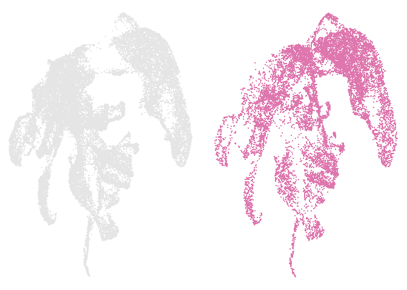<!-- -->

``` r
#Umaps split by treatment

DimPlot(merge_os_nema, group.by = "Treatment", cols = cols_treat, 
        split.by = "Treatment")& 
  theme_void()& 
  ggtitle(NULL) &
  theme(legend.position = "none",
        strip.text.x = element_blank())
```

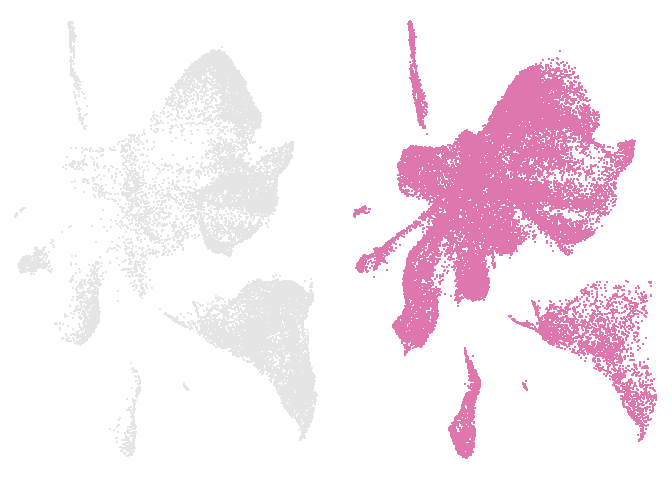<!-- -->

``` r
# Stats of cluster frequency

treatment_nema <- merge_at_nema@meta.data %>%
  select(Cell_type, Treatment, Cluster)


test <- chisq.test(table(treatment_nema$Cluster, treatment_nema$Treatment))
df <- table(treatment_nema$Cluster, treatment_nema$Treatment)
df1 <- cbind(df, t(apply(df, 1, function(x) {
  ch <- chisq.test(x, p = c(0.716, 0.284))
  c(unname(ch$statistic), ch$p.value, ch$expected)
})))
colnames(df1) <- c("Mock_obs", "Inf_obs", "xsquared", "pvalue", "Mock_exp", "Inf_exp")
df1 <- df1 %>%
  as.data.frame() %>%
  mutate(
    freq = (Inf_obs / Mock_obs),
    freq_fold = (Inf_obs / Mock_obs) / 0.284
  ) %>%
  arrange(desc(freq_fold))
df1 %>% 
  head(5)
```

    ##      Mock_obs Inf_obs  xsquared        pvalue Mock_exp  Inf_exp     freq
    ## At8       364    1900 3432.2535  0.000000e+00 1621.024  642.976 5.219780
    ## At28      105     244  295.7904  2.722225e-66  249.884   99.116 2.323810
    ## At18      375     671  657.4027 5.484982e-145  748.936  297.064 1.789333
    ## At0      2341    2617 1449.6494 3.416931e-317 3549.928 1408.072 1.117898
    ## At27      250     247  110.8691  6.321072e-26  355.852  141.148 0.988000
    ##      freq_fold
    ## At8  18.379508
    ## At28  8.182428
    ## At18  6.300469
    ## At0   3.936262
    ## At27  3.478873

``` r
# Sort cluster by frequency
merge_at_nema@meta.data <- merge_at_nema@meta.data %>%
  mutate(Cluster = fct_relevel(Cluster, rownames(df1)))
at_cluster_treat <- ggplot(data = merge_at_nema@meta.data, aes(x = Cluster, fill = factor(Treatment))) +
  geom_bar(position = "fill") +
  scale_fill_manual(values = cols_treat) +
  theme_classic() +
  geom_hline(yintercept = 0.284, linetype = "dashed", linewidth = 0.1) +
  ylab("Frequency") +
  theme_paper +
  xlab("Cluster") +
  coord_flip()

at_cluster_treat
```

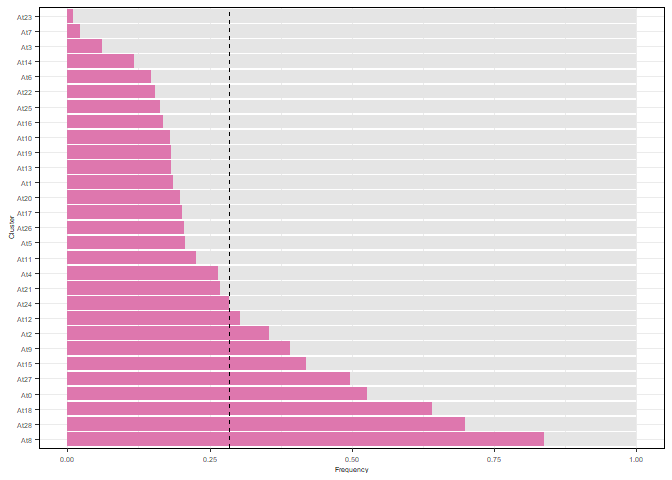<!-- -->

``` r
#Stats of cluster frequency

treatment_nema <- merge_os_nema@meta.data%>% 
  select(Treatment,Cluster)


test <- chisq.test(table(treatment_nema$Cluster,treatment_nema$Treatment))
df<-table(treatment_nema$Cluster,treatment_nema$Treatment)
df1 <- cbind(df, t(apply(df, 1, function(x) {
  ch <- chisq.test(x,p = c(0.378,0.622))
  c(unname(ch$statistic), ch$p.value,ch$expected)})))
colnames(df1) <- c("Mock_obs","Inf_obs",'xsquared', 'pvalue',"Mock_exp", "Inf_exp")
df1<-df1 %>% as.data.frame() %>% mutate(freq=(Inf_obs/Mock_obs),
                                        freq_fold=(Inf_obs/Mock_obs)/0.622) %>% 
  arrange(desc(freq_fold))
df1 %>% 
  head(5)
```

    ##      Mock_obs Inf_obs xsquared        pvalue Mock_exp  Inf_exp      freq
    ## Os17       19    1737 1006.932 5.590465e-221  663.768 1092.232 91.421053
    ## Os16       56    2005 1078.912 1.265444e-236  779.058 1281.942 35.803571
    ## Os3       201    3072 1395.256 2.255647e-305 1237.194 2035.806 15.283582
    ## Os9       231    2508 1004.633 1.767270e-220 1035.342 1703.658 10.857143
    ## Os0       719    5491 1816.092  0.000000e+00 2347.380 3862.620  7.636996
    ##      freq_fold
    ## Os17 146.97918
    ## Os16  57.56201
    ## Os3   24.57168
    ## Os9   17.45521
    ## Os0   12.27813

``` r
#Sort cluster by frequency
merge_os_nema@meta.data<-merge_os_nema@meta.data %>% 
  mutate(Cluster=fct_relevel(Cluster, rownames(df1)))
os_cluster_treat <- ggplot(data=merge_os_nema@meta.data, aes(x=Cluster, fill=factor(Treatment))) +
  geom_bar(position="fill")+
  scale_fill_manual(values=cols_treat)+
  theme_classic()+
  geom_hline(yintercept=0.622,linetype = "dashed",linewidth=0.1)+
  ylab("Frequency")+
 theme_paper+
  xlab("Cluster")+
  coord_flip()

os_cluster_treat
```

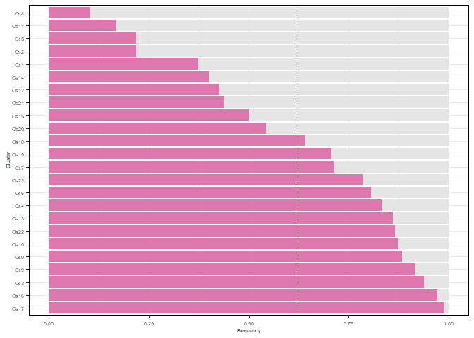<!-- -->
\## Gene expression of known RKN responsive genes

``` r
#FeaturePlots of known markers
#WRKY23
wrky23<-FeaturePlot(merge_at_nema,"AT2G47260",pt.size = 0.05,order=TRUE,keep.scale="all")+
  scale_colour_gradientn(colours=rev(brewer.pal(11,"PiYG")[1:6]))+ggtitle("AtWRKY23")+
  theme_void()
```

    ## Scale for colour is already present.
    ## Adding another scale for colour, which will replace the existing scale.

``` r
lox<-FeaturePlot(merge_at_nema,"AT1G17420",pt.size = 0.05,order=TRUE,keep.scale="all")+
 scale_colour_gradientn(colours=rev(brewer.pal(11,"PiYG")[1:6]))+ggtitle("AtLOX3")+
  theme_void()
```

    ## Scale for colour is already present.
    ## Adding another scale for colour, which will replace the existing scale.

``` r
pdf2.2<-FeaturePlot(merge_at_nema,"AT2G02100",pt.size = 0.05,order=TRUE,keep.scale="all")+
  scale_colour_gradientn(colours=rev(brewer.pal(11,"PiYG")[1:6]))+ggtitle("AtPDF2.2")+
  theme_void()
```

    ## Scale for colour is already present.
    ## Adding another scale for colour, which will replace the existing scale.

``` r
wrky23 +lox+pdf2.2+plot_layout(ncol = 3)
```

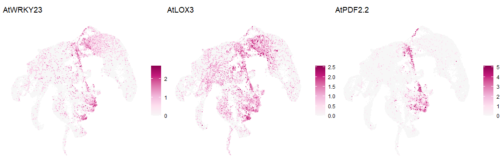<!-- -->

``` r
pdf <- FeaturePlot(merge_os_nema,"Os02g0629800",pt.size = 0.05,order=TRUE,keep.scale="all")+
  scale_colour_gradientn(colours=rev(brewer.pal(11,"PiYG")[1:6]))+
  theme_void()+ggtitle("osDEF7")
```

    ## Scale for colour is already present.
    ## Adding another scale for colour, which will replace the existing scale.

``` r
del1 <- FeaturePlot(merge_os_nema,"Os02g0739700",pt.size = 0.05,order=TRUE,keep.scale="all")+
 scale_colour_gradientn(colours=rev(brewer.pal(11,"PiYG")[1:6]))+
  theme_void()+ggtitle("osDEL1")
```

    ## Scale for colour is already present.
    ## Adding another scale for colour, which will replace the existing scale.

``` r
erf <- FeaturePlot(merge_os_nema,"Os09g0457900",pt.size = 0.05,order=TRUE,keep.scale="all")+
  scale_colour_gradientn(colours=rev(brewer.pal(11,"PiYG")[1:6]))+
  theme_void()+ggtitle("OsERF102")
```

    ## Scale for colour is already present.
    ## Adding another scale for colour, which will replace the existing scale.

``` r
pdf +del1+erf+plot_layout(ncol = 3)
```

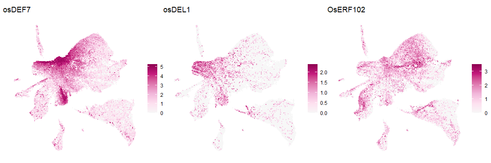<!-- -->
\## Nematode score calculation

We are going to use bulK RNA-seq studies under nematode infection to
evaluate in our scRNA-seq dataset which cells are showing a profile that
corresponds to nematode response.

### Nematode score in *Arabidopsis* dataset

``` r
# Directory resources

directory_resources <- file.path("..","..","data","resources","03_Nematode_clusters")
```

``` r
#Read files upregulated genes and create matrix
files_up <- list.files(path=(file.path(directory_resources,"Ath_up")),full.names = TRUE)
up_data <- files_up %>%
  map_dfr(~read.csv(.x, header = TRUE) %>% 
            select(Gene) %>%  # Only keep the Gene column
            mutate(file = tools::file_path_sans_ext(basename(.x))),  # Add file name without extension
          .id = "file_id")
# Create the presence/absence matrix
gene_matrix <- up_data %>%
  mutate(present = 1) %>%  # Add a column to indicate presence
  pivot_wider(
    id_cols = Gene,
    names_from = file,
    values_from = present,
    values_fill = 0  # Fill NA values with 0
  ) %>%
  column_to_rownames("Gene")  # Make Gene the row names

gene_matrix <- gene_matrix %>% mutate(across(everything(), as.numeric))

head(gene_matrix)
```

    ##           Ath_14dpi Ath_21dpi Ath_3dpi_1 Ath_3dpi_2 Ath_7dpi
    ## AT2G32240         1         0          0          0        0
    ## AT1G12560         1         1          0          0        0
    ## AT1G12630         1         0          0          0        0
    ## AT1G17210         1         0          0          0        0
    ## AT1G48410         1         0          0          0        0
    ## AT1G50480         1         0          0          0        0

``` r
#write.table(gene_matrix, file = file.path(directory_resources,"ath_gene_presence_matrix.txt"), quote = FALSE, row.names = TRUE, col.names = TRUE, sep = "\t")
```

``` r
# Calculate row sums
up_data_sum <- gene_matrix %>%
  as.data.frame() %>%
  rownames_to_column("Gene") %>%
  dplyr::mutate(sum = rowSums(across(where(is.numeric))))
```

``` r
ath_bulk_bar <- ggplot(up_data_sum, aes(factor(sum),fill=factor(sum))) +
  geom_bar(stat="count", position = "dodge")+
  scale_fill_manual(values = c("grey90","grey90",
                              "#DE77AE","#DE77AE","#DE77AE"))+
  theme_classic()+
  coord_flip()+
  ylab("Up-regulated genes")+
  xlab(NULL)+
  scale_y_continuous(limits = c(0, 1250), breaks = c(0, 500, 1000))+
  theme_notebook
```

``` r
ath_bulk_bar
```

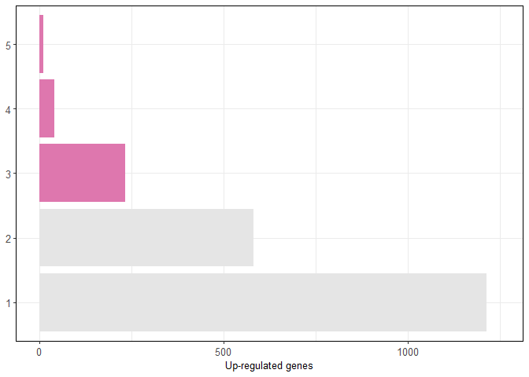<!-- -->

``` r
#Select genes upregulated in at least 3 studies
nema_up_core <- gene_matrix[rowSums(gene_matrix,na.rm=TRUE)>2,]
nema_up_core <- rownames(nema_up_core)
```

``` r
#write.table(nema_up_core, file = file.path(directory_resources,"ath_nema_core_genes.txt"), quote = FALSE, row.names = FALSE, col.names = FALSE, sep = "\t")
```

``` r
#Extract expression data of nematode core genes and calculate nematode score
count.data <- GetAssayData(merge_at_nema, slot="counts",assay = "SCT")
```

    ## Warning: The `slot` argument of `GetAssayData()` is deprecated as of SeuratObject 5.0.0.
    ## ℹ Please use the `layer` argument instead.
    ## This warning is displayed once every 8 hours.
    ## Call `lifecycle::last_lifecycle_warnings()` to see where this warning was
    ## generated.

``` r
nema_up_data <- count.data[rownames(count.data) %in% nema_up_core,]
nema_up_data <- as.matrix(nema_up_data)
nema_up_data_z <-t(scale(t(nema_up_data)))
nema_sum_z <- colSums(nema_up_data_z)
nema_sum_z <- rescale(nema_sum_z,to=c(-1,5))
```

``` r
#Assign nematode score and positive cells
merge_at_nema[["nema_score"]]<-nema_sum_z
nemacells <- WhichCells(merge_at_nema, expression = nema_score >0.5)
merge_at_nema$nema_profile<- ifelse(colnames(merge_at_nema) %in% nemacells, "Pos", "Neg")
```

``` r
ath_nema_score_umap <- DimPlot(merge_at_nema, group.by = "nema_profile",cols = c("grey90","#DE77AE"),order = "Pos",pt.size = 0.05)+
  theme_void()+
  theme(legend.position="none")+
  ggtitle(NULL)
```

``` r
ath_nema_score_umap
```

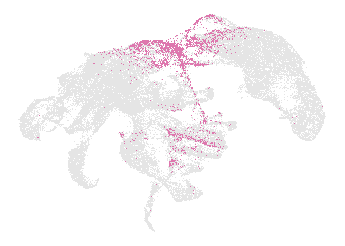<!-- -->

``` r
#Proportion of cells from mock and infected samples assigned as positive for nematode responsive cells
table(merge_at_nema@meta.data$nema_profile,merge_at_nema@meta.data$Treatment) %>% prop.table(2)
```

    ##      
    ##             Mock   Infected
    ##   Neg 0.97822667 0.87769378
    ##   Pos 0.02177333 0.12230622

``` r
density_nema <- merge_at_nema@meta.data %>% 
  select(Treatment,nema_score,nema_profile,Nema_cluster) %>% 
  mutate(Nema_cluster = factor(Nema_cluster, levels = c("Other","At8","At28")))

density_score <- ggplot(density_nema, aes(x=nema_score, fill=Nema_cluster)) +
  annotate("rect", xmin = 0.5, xmax =3, ymin = 0, ymax = 2, 
           alpha = 0.6,fill="#DE77AE")+
  geom_density(alpha=0.8,size=0.1)+
  scale_x_continuous(limits = c(-1, 3), breaks = c(-1,0.5,3))+
  scale_y_continuous(limits = c(0, 2), breaks = c(0,1,2))+
  theme_notebook+
  scale_fill_manual(values=cols_nema_at)+
  geom_vline(xintercept = 0.5,
             linetype = 2,
             size=0.1,
             color = "#DE77AE")+
  ylab("Density")+
  xlab("Nematode score")+theme(axis.text.y=element_blank(),
                               axis.ticks.y=element_blank(),
                               panel.spacing = unit(0.2, "lines"),
                               strip.background = element_blank())+
  facet_grid(rows = vars(Nema_cluster))
```

``` r
density_score
```

    ## Warning: Removed 38 rows containing non-finite values (`stat_density()`).

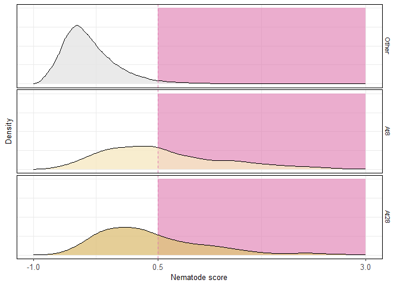<!-- -->

### Nematode score in rice dataset

``` r
#Read files upregulated genes and create matrix
files_up <- list.files(path=(file.path(directory_resources,"Osa_up")),full.names = TRUE)
up_data <- files_up %>%
  map_dfr(~read.csv(.x, header = TRUE) %>% 
            select(Gene) %>%  # Only keep the Gene column
            mutate(file = tools::file_path_sans_ext(basename(.x))),  # Add file name without extension
          .id = "file_id")
# Create the presence/absence matrix
gene_matrix <- up_data %>%
  dplyr::group_by(Gene,file) %>% distinct() %>% #delete duplicated genes in a file
  ungroup() %>% 
  mutate(present = 1) %>%  # Add a column to indicate presence
  pivot_wider(
    id_cols = Gene,
    names_from = file,
    values_from = present,
    values_fill = 0  # Fill NA values with 0
  ) %>%
  column_to_rownames("Gene")  # Make Gene the row names

gene_matrix <- gene_matrix %>% mutate(across(everything(), as.numeric))

head(gene_matrix)
```

    ##              Osa_14dpi_1 Osa_14dpi_2 Osa_18hpi Osa_3dpi Osa_7dpi
    ## Os12g0569200           1           0         0        1        1
    ## Os09g0448200           1           0         1        0        1
    ## Os05g0498300           1           0         0        1        1
    ## Os06g0341600           1           0         0        0        1
    ## Os03g0616300           1           0         0        0        0
    ## Os09g0563250           1           0         0        0        1

``` r
#write.table(gene_matrix, file = file.path(directory_resources,"osa_gene_presence_matrix.txt"), quote = FALSE, row.names = TRUE, col.names = TRUE, sep = "\t")
```

``` r
# Calculate row sums
up_data_sum <- gene_matrix %>%
  as.data.frame() %>%
  rownames_to_column("Gene") %>%
  dplyr::mutate(sum = rowSums(across(where(is.numeric))))
```

``` r
osa_bulk_bar <- ggplot(up_data_sum, aes(factor(sum),fill=factor(sum))) +
  geom_bar(stat="count", position = "dodge")+
  scale_fill_manual(values = c("grey90","grey90",
                              "#DE77AE","#DE77AE","#DE77AE"))+
  theme_classic()+
  coord_flip()+
  ylab("Up-regulated genes")+
  xlab(NULL)+
  theme_notebook+
  scale_y_continuous(limits = c(0, 7000), breaks = c(0, 3500, 7000))
```

``` r
osa_bulk_bar
```

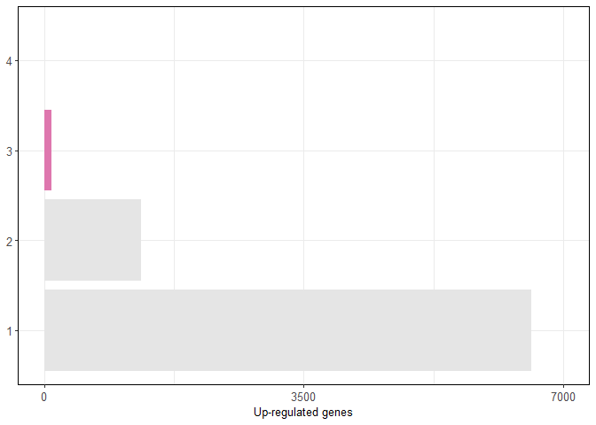<!-- -->

``` r
#Select genes upregulated in at least 3 studies
nema_up_core <- gene_matrix[rowSums(gene_matrix,na.rm=TRUE)>2,]
nema_up_core <- rownames(nema_up_core)
```

``` r
#write.table(nema_up_core, file = file.path(directory_resources,"Nema_score","osa_nema_core_genes.txt"), quote = FALSE, row.names = FALSE, col.names = FALSE, sep = "\t")
```

``` r
#Extract expression data of nematode core genes and calculate nematode score
count.data <- GetAssayData(merge_os_nema, slot="counts",assay = "SCT")

nema_up_data <- count.data[rownames(count.data) %in% nema_up_core,]
nema_up_data <- as.matrix(nema_up_data)
nema_up_data_z <-t(scale(t(nema_up_data)))
nema_sum_z <- colSums(nema_up_data_z)
nema_sum_z <- rescale(nema_sum_z,to=c(-1,5))
```

``` r
#Assign nematode score and positive cells
merge_os_nema[["nema_score"]]<-nema_sum_z
nemacells <- WhichCells(merge_os_nema, expression = nema_score >1)
merge_os_nema$nema_profile<- ifelse(colnames(merge_os_nema) %in% nemacells, "Pos", "Neg")
```

``` r
#Proportion of cells from mock and infected samples assigned as positive for nematode responsive cells
table(merge_os_nema@meta.data$nema_profile,merge_os_nema@meta.data$Treatment) %>% prop.table(2)
```

    ##      
    ##             Mock   Infected
    ##   Neg 0.98049787 0.90065564
    ##   Pos 0.01950213 0.09934436

``` r
osa_nema_score_umap <- DimPlot(merge_os_nema, group.by = "nema_profile",cols = c("grey90","#DE77AE"),order = "Pos",pt.size = 0.05)+
  theme_void()+
  theme(legend.position="none")+
  ggtitle(NULL)
```

``` r
osa_nema_score_umap
```

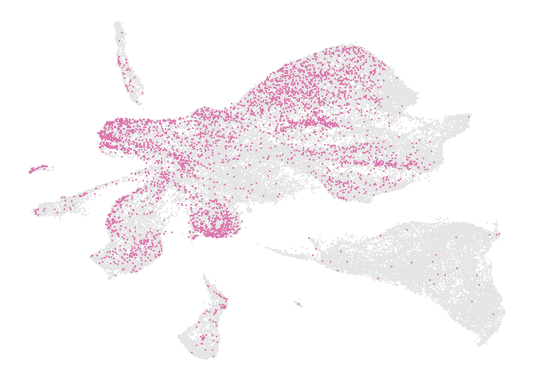<!-- -->

``` r
density_nema <- merge_os_nema@meta.data %>% 
  mutate(Nema_cluster = factor(Nema_cluster, levels = c("Other","Os3","Os9","Os10","Os16","Os17")))

density_score <- ggplot(density_nema, aes(x=nema_score, fill=Nema_cluster)) +
  annotate("rect", xmin = 1, xmax =2, ymin = 0, ymax = 1, 
           alpha = 0.6,fill="#DE77AE")+
  geom_density(alpha=0.8,size=0.1)+
  scale_x_continuous(limits = c(-1.1, 2), breaks = c(-1,1,2))+
  scale_y_continuous(limits = c(0, 1))+
  theme_notebook+
  scale_fill_manual(values=cols_nema_os)+
  geom_vline(xintercept = 1,
             linetype = 2,
             size=0.1,
             color = "#DE77AE")+
  ylab("Density")+
  xlab("Nematode score")+theme(axis.text.y=element_blank(),
                               axis.ticks.y=element_blank(),
                               panel.spacing = unit(0.1, "lines"),
                               strip.background = element_blank())+
  facet_grid(rows = vars(Nema_cluster))
```

``` r
density_score
```

    ## Warning: Removed 209 rows containing non-finite values (`stat_density()`).

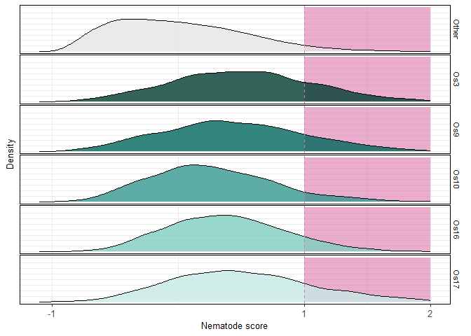<!-- -->

``` r
sessionInfo()
```

    ## R version 4.2.1 (2022-06-23 ucrt)
    ## Platform: x86_64-w64-mingw32/x64 (64-bit)
    ## Running under: Windows 10 x64 (build 19045)
    ## 
    ## Matrix products: default
    ## 
    ## locale:
    ## [1] LC_COLLATE=Spanish_Spain.utf8  LC_CTYPE=Spanish_Spain.utf8   
    ## [3] LC_MONETARY=Spanish_Spain.utf8 LC_NUMERIC=C                  
    ## [5] LC_TIME=Spanish_Spain.utf8    
    ## 
    ## attached base packages:
    ##  [1] tools     stats4    grid      stats     graphics  grDevices utils    
    ##  [8] datasets  methods   base     
    ## 
    ## other attached packages:
    ##  [1] lisi_1.0                    harmony_1.1.0              
    ##  [3] scater_1.26.1               scuttle_1.6.3              
    ##  [5] ggVennDiagram_1.5.2         igraph_2.0.1.1             
    ##  [7] muscatWrapper_1.0.0         xlsx_0.6.5                 
    ##  [9] edgeR_3.38.4                limma_3.52.4               
    ## [11] SingleCellExperiment_1.18.1 muscat_1.10.1              
    ## [13] ggpubr_0.6.0                corto_1.2.2                
    ## [15] ggh4x_0.2.8                 ggrepel_0.9.4              
    ## [17] rrvgo_1.8.0                 ontologyIndex_2.11         
    ## [19] pheatmap_1.0.12             ggsankey_0.0.99999         
    ## [21] future_1.33.0               ggthemes_4.2.4             
    ## [23] lubridate_1.9.3             dplyr_1.1.3                
    ## [25] purrr_1.0.2                 readr_2.1.2                
    ## [27] tidyr_1.3.1                 tibble_3.2.1               
    ## [29] tidyverse_2.0.0             scales_1.3.0               
    ## [31] RColorBrewer_1.1-3          rhdf5_2.40.0               
    ## [33] SummarizedExperiment_1.26.1 Biobase_2.56.0             
    ## [35] MatrixGenerics_1.8.1        Rcpp_1.0.11                
    ## [37] Matrix_1.6-1                GenomicRanges_1.48.0       
    ## [39] GenomeInfoDb_1.32.4         IRanges_2.30.1             
    ## [41] S4Vectors_0.34.0            BiocGenerics_0.44.0        
    ## [43] matrixStats_1.1.0           data.table_1.14.8          
    ## [45] stringr_1.5.1               plyr_1.8.9                 
    ## [47] magrittr_2.0.3              gtable_0.3.5               
    ## [49] ArchR_1.0.2                 gtools_3.9.4               
    ## [51] clustree_0.5.1              ggraph_2.1.0               
    ## [53] ggcorrplot_0.1.4.1          gridExtra_2.3              
    ## [55] patchwork_1.1.3             forcats_1.0.0              
    ## [57] rlang_1.1.2                 SeuratObject_5.0.0         
    ## [59] Seurat_4.4.0                ggplot2_3.4.4              
    ## 
    ## loaded via a namespace (and not attached):
    ##   [1] rsvd_1.0.5                ica_1.0-3                
    ##   [3] foreach_1.5.2             lmtest_0.9-40            
    ##   [5] crayon_1.5.2              rbibutils_2.2.16         
    ##   [7] MASS_7.3-58.1             rhdf5filters_1.8.0       
    ##   [9] nlme_3.1-159              backports_1.4.1          
    ##  [11] sva_3.46.0                GOSemSim_2.22.0          
    ##  [13] XVector_0.36.0            ROCR_1.0-11              
    ##  [15] irlba_2.3.5.1             nloptr_2.0.3             
    ##  [17] BiocParallel_1.30.4       rjson_0.2.21             
    ##  [19] bit64_4.0.5               glue_1.6.2               
    ##  [21] sctransform_0.4.1         pbkrtest_0.5.2           
    ##  [23] parallel_4.2.1            vipor_0.4.5              
    ##  [25] spatstat.sparse_3.0-3     AnnotationDbi_1.60.0     
    ##  [27] dotCall64_1.1-0           spatstat.geom_3.2-7      
    ##  [29] tidyselect_1.2.0          fitdistrplus_1.1-11      
    ##  [31] variancePartition_1.28.0  XML_3.99-0.15            
    ##  [33] zoo_1.8-12                xtable_1.8-4             
    ##  [35] evaluate_0.23             Rdpack_2.6               
    ##  [37] cli_3.6.1                 zlibbioc_1.42.0          
    ##  [39] rstudioapi_0.15.0         miniUI_0.1.1.1           
    ##  [41] sp_2.1-3                  aod_1.3.2                
    ##  [43] wordcloud_2.6             locfdr_1.1-8             
    ##  [45] shiny_1.8.0               BiocSingular_1.12.0      
    ##  [47] xfun_0.41                 tm_0.7-15                
    ##  [49] clue_0.3-65               cluster_2.1.4            
    ##  [51] caTools_1.18.2            tidygraph_1.3.0          
    ##  [53] KEGGREST_1.38.0           listenv_0.9.0            
    ##  [55] xlsxjars_0.6.1            Biostrings_2.64.1        
    ##  [57] png_0.1-8                 withr_3.0.1              
    ##  [59] bitops_1.0-7              slam_0.1-50              
    ##  [61] ggforce_0.4.1             dqrng_0.3.1              
    ##  [63] pillar_1.9.0              gplots_3.1.3             
    ##  [65] GlobalOptions_0.1.2       cachem_1.0.8             
    ##  [67] multcomp_1.4-25           NLP_0.3-2                
    ##  [69] GetoptLong_1.0.5          DelayedMatrixStats_1.20.0
    ##  [71] vctrs_0.6.4               ellipsis_0.3.2           
    ##  [73] generics_0.1.3            beeswarm_0.4.0           
    ##  [75] munsell_0.5.1             tweenr_2.0.2             
    ##  [77] emmeans_1.8.9             DelayedArray_0.22.0      
    ##  [79] fastmap_1.1.1             compiler_4.2.1           
    ##  [81] abind_1.4-5               httpuv_1.6.12            
    ##  [83] rJava_1.0-6               plotly_4.10.3            
    ##  [85] GenomeInfoDbData_1.2.9    glmmTMB_1.1.8            
    ##  [87] lattice_0.20-45           deldir_1.0-9             
    ##  [89] utf8_1.2.4                later_1.3.1              
    ##  [91] jsonlite_1.8.8            ScaledMatrix_1.6.0       
    ##  [93] pbapply_1.7-2             carData_3.0-5            
    ##  [95] sparseMatrixStats_1.8.0   estimability_1.4.1       
    ##  [97] genefilter_1.78.0         lazyeval_0.2.2           
    ##  [99] promises_1.2.1            car_3.1-2                
    ## [101] doParallel_1.0.17         goftest_1.2-3            
    ## [103] spatstat.utils_3.1-0      reticulate_1.34.0        
    ## [105] rmarkdown_2.25            sandwich_3.0-2           
    ## [107] cowplot_1.1.1             blme_1.0-5               
    ## [109] statmod_1.5.0             Rtsne_0.16               
    ## [111] uwot_0.1.16               treemap_2.4-4            
    ## [113] survival_3.4-0            numDeriv_2016.8-1.1      
    ## [115] yaml_2.3.7                plotrix_3.8-4            
    ## [117] htmltools_0.5.7           memoise_2.0.1            
    ## [119] locfit_1.5-9.8            graphlayouts_1.1.0       
    ## [121] viridisLite_0.4.2         RhpcBLASctl_0.23-42      
    ## [123] digest_0.6.33             mime_0.12                
    ## [125] spam_2.10-0               RSQLite_2.3.3            
    ## [127] future.apply_1.11.0       blob_1.2.4               
    ## [129] labeling_0.4.3            splines_4.2.1            
    ## [131] Rhdf5lib_1.18.2           RCurl_1.98-1.13          
    ## [133] broom_1.0.5               hms_1.1.3                
    ## [135] colorspace_2.1-0          ggbeeswarm_0.7.2         
    ## [137] shape_1.4.6               RANN_2.6.1               
    ## [139] mvtnorm_1.2-3             circlize_0.4.15          
    ## [141] fansi_1.0.5               tzdb_0.3.0               
    ## [143] parallelly_1.36.0         R6_2.5.1                 
    ## [145] ggridges_0.5.4            lifecycle_1.0.4          
    ## [147] bluster_1.8.0             ggsignif_0.6.4           
    ## [149] minqa_1.2.6               leiden_0.4.3             
    ## [151] RcppAnnoy_0.0.21          TH.data_1.1-2            
    ## [153] iterators_1.0.14          spatstat.explore_3.2-5   
    ## [155] TMB_1.9.6                 htmlwidgets_1.6.2        
    ## [157] beachmat_2.12.0           polyclip_1.10-6          
    ## [159] timechange_0.2.0          ComplexHeatmap_2.14.0    
    ## [161] mgcv_1.8-40               globals_0.16.2           
    ## [163] spatstat.random_3.2-1     progressr_0.14.0         
    ## [165] codetools_0.2-18          metapod_1.6.0            
    ## [167] GO.db_3.15.0              prettyunits_1.2.0        
    ## [169] gridBase_0.4-7            DBI_1.1.3                
    ## [171] highr_0.10                tensor_1.5               
    ## [173] httr_1.4.7                KernSmooth_2.23-20       
    ## [175] stringi_1.8.1             progress_1.2.3           
    ## [177] reshape2_1.4.4            farver_2.1.1             
    ## [179] annotate_1.76.0           viridis_0.6.5            
    ## [181] xml2_1.3.5                boot_1.3-28              
    ## [183] BiocNeighbors_1.14.0      lme4_1.1-35.1            
    ## [185] geneplotter_1.76.0        scattermore_1.2          
    ## [187] scran_1.26.0              DESeq2_1.36.0            
    ## [189] bit_4.0.5                 spatstat.data_3.0-3      
    ## [191] pkgconfig_2.0.3           lmerTest_3.1-3           
    ## [193] rstatix_0.7.2             knitr_1.45
