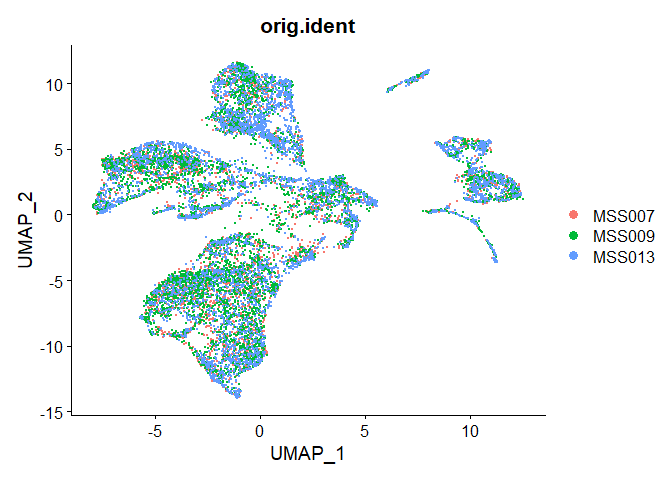
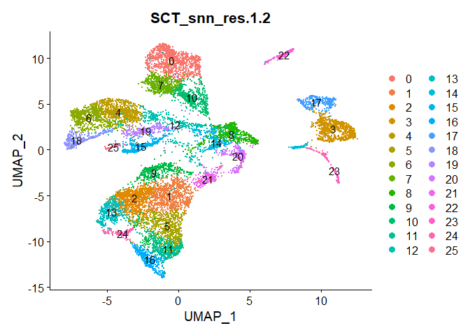
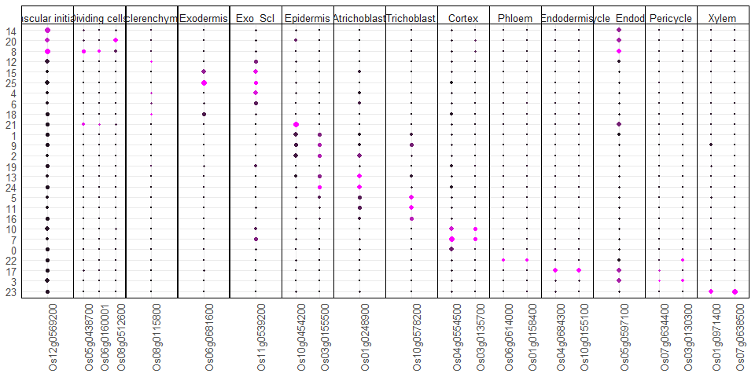
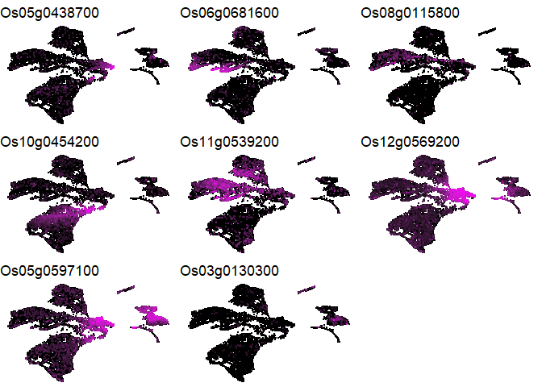
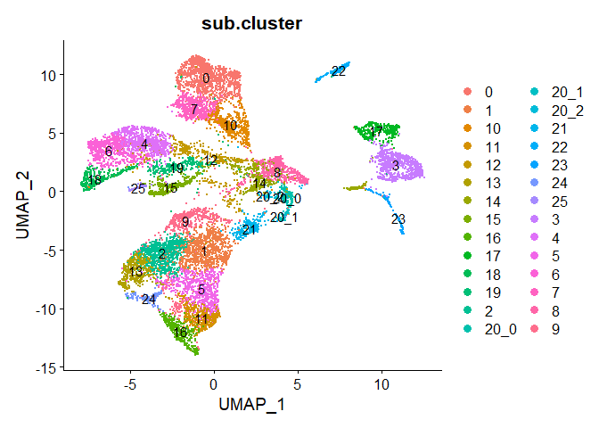
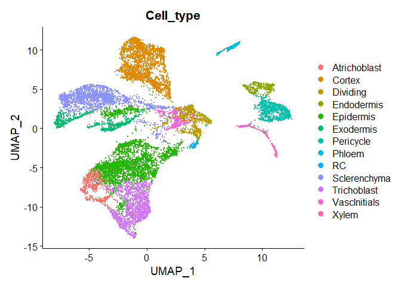
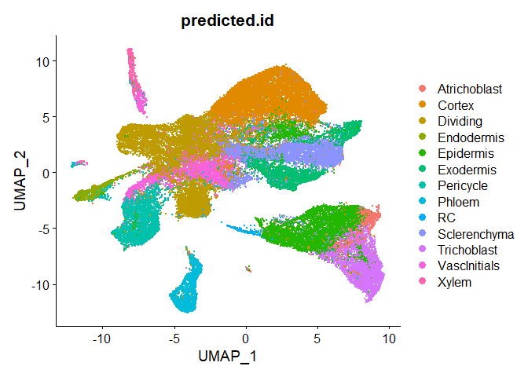
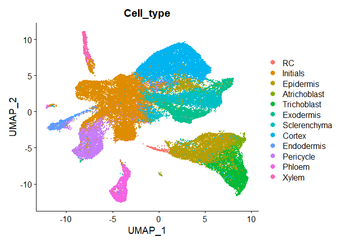

Cell type annotation of rice dataset
================

``` r
# Load resources. Libraries, paths, functions, themes.
source(file.path("..", "..", "scripts", "config.R"))
```

``` r
#Read merged dataset
merge_os_mock <- readRDS(OSA_DATA_PATH_MOCK)
merge_os_nema <- readRDS(OSA_DATA_PATH)
```

## Annotating rice mock dataset by cell type

We use first the mock samples from three biological replicates (R1, R2,
R3) to manually annotate the clusters based on the expression of
experimentally validated by RNA *in situ* hybridization cell type
specific markers in rice.

``` r
DimPlot(merge_os_mock, group.by = "orig.ident")
```

<!-- -->
First we perform an unsupervised clustering to select the best
resolution to annotate the cell types.

``` r
merge_os_mock <- FindNeighbors(merge_os_mock, dims = 1:30, 
                               verbose = FALSE,reduction="pca")
merge_os_mock <- FindClusters(merge_os_mock, graph.name="SCT_snn",
                              resolution=seq(0.1,1.5,0.1))
```

    ## Modularity Optimizer version 1.3.0 by Ludo Waltman and Nees Jan van Eck
    ## 
    ## Number of nodes: 12929
    ## Number of edges: 422692
    ## 
    ## Running Louvain algorithm...
    ## Maximum modularity in 10 random starts: 0.9628
    ## Number of communities: 7
    ## Elapsed time: 0 seconds
    ## Modularity Optimizer version 1.3.0 by Ludo Waltman and Nees Jan van Eck
    ## 
    ## Number of nodes: 12929
    ## Number of edges: 422692
    ## 
    ## Running Louvain algorithm...
    ## Maximum modularity in 10 random starts: 0.9452
    ## Number of communities: 10
    ## Elapsed time: 0 seconds
    ## Modularity Optimizer version 1.3.0 by Ludo Waltman and Nees Jan van Eck
    ## 
    ## Number of nodes: 12929
    ## Number of edges: 422692
    ## 
    ## Running Louvain algorithm...
    ## Maximum modularity in 10 random starts: 0.9321
    ## Number of communities: 14
    ## Elapsed time: 1 seconds
    ## Modularity Optimizer version 1.3.0 by Ludo Waltman and Nees Jan van Eck
    ## 
    ## Number of nodes: 12929
    ## Number of edges: 422692
    ## 
    ## Running Louvain algorithm...
    ## Maximum modularity in 10 random starts: 0.9217
    ## Number of communities: 16
    ## Elapsed time: 0 seconds
    ## Modularity Optimizer version 1.3.0 by Ludo Waltman and Nees Jan van Eck
    ## 
    ## Number of nodes: 12929
    ## Number of edges: 422692
    ## 
    ## Running Louvain algorithm...
    ## Maximum modularity in 10 random starts: 0.9132
    ## Number of communities: 17
    ## Elapsed time: 1 seconds
    ## Modularity Optimizer version 1.3.0 by Ludo Waltman and Nees Jan van Eck
    ## 
    ## Number of nodes: 12929
    ## Number of edges: 422692
    ## 
    ## Running Louvain algorithm...
    ## Maximum modularity in 10 random starts: 0.9043
    ## Number of communities: 18
    ## Elapsed time: 1 seconds
    ## Modularity Optimizer version 1.3.0 by Ludo Waltman and Nees Jan van Eck
    ## 
    ## Number of nodes: 12929
    ## Number of edges: 422692
    ## 
    ## Running Louvain algorithm...
    ## Maximum modularity in 10 random starts: 0.8972
    ## Number of communities: 19
    ## Elapsed time: 1 seconds
    ## Modularity Optimizer version 1.3.0 by Ludo Waltman and Nees Jan van Eck
    ## 
    ## Number of nodes: 12929
    ## Number of edges: 422692
    ## 
    ## Running Louvain algorithm...
    ## Maximum modularity in 10 random starts: 0.8911
    ## Number of communities: 22
    ## Elapsed time: 1 seconds
    ## Modularity Optimizer version 1.3.0 by Ludo Waltman and Nees Jan van Eck
    ## 
    ## Number of nodes: 12929
    ## Number of edges: 422692
    ## 
    ## Running Louvain algorithm...
    ## Maximum modularity in 10 random starts: 0.8837
    ## Number of communities: 22
    ## Elapsed time: 1 seconds
    ## Modularity Optimizer version 1.3.0 by Ludo Waltman and Nees Jan van Eck
    ## 
    ## Number of nodes: 12929
    ## Number of edges: 422692
    ## 
    ## Running Louvain algorithm...
    ## Maximum modularity in 10 random starts: 0.8785
    ## Number of communities: 24
    ## Elapsed time: 1 seconds
    ## Modularity Optimizer version 1.3.0 by Ludo Waltman and Nees Jan van Eck
    ## 
    ## Number of nodes: 12929
    ## Number of edges: 422692
    ## 
    ## Running Louvain algorithm...
    ## Maximum modularity in 10 random starts: 0.8735
    ## Number of communities: 26
    ## Elapsed time: 1 seconds
    ## Modularity Optimizer version 1.3.0 by Ludo Waltman and Nees Jan van Eck
    ## 
    ## Number of nodes: 12929
    ## Number of edges: 422692
    ## 
    ## Running Louvain algorithm...
    ## Maximum modularity in 10 random starts: 0.8690
    ## Number of communities: 26
    ## Elapsed time: 1 seconds
    ## Modularity Optimizer version 1.3.0 by Ludo Waltman and Nees Jan van Eck
    ## 
    ## Number of nodes: 12929
    ## Number of edges: 422692
    ## 
    ## Running Louvain algorithm...
    ## Maximum modularity in 10 random starts: 0.8641
    ## Number of communities: 27
    ## Elapsed time: 1 seconds
    ## Modularity Optimizer version 1.3.0 by Ludo Waltman and Nees Jan van Eck
    ## 
    ## Number of nodes: 12929
    ## Number of edges: 422692
    ## 
    ## Running Louvain algorithm...
    ## Maximum modularity in 10 random starts: 0.8602
    ## Number of communities: 28
    ## Elapsed time: 1 seconds
    ## Modularity Optimizer version 1.3.0 by Ludo Waltman and Nees Jan van Eck
    ## 
    ## Number of nodes: 12929
    ## Number of edges: 422692
    ## 
    ## Running Louvain algorithm...
    ## Maximum modularity in 10 random starts: 0.8566
    ## Number of communities: 29
    ## Elapsed time: 0 seconds

``` r
DimPlot(merge_os_mock, group.by = "SCT_snn_res.1.2", label = TRUE)
```

<!-- -->

``` r
#Dotplot with markers

#Load file with known validated markers
markers <- read.table(file.path("..","..","data","resources","04_Cell_type_rice",
                                "validated_markers.txt"),header=TRUE, sep="\t")
markers_vector <- c(markers$Gene)
markers_name <- c(markers$Cell_type)

markers_seurat <- setNames(markers_vector, markers_name)

p <-DotPlot(object = merge_os_mock, features = markers_seurat,
            group.by = "SCT_snn_res.1.2")
```

    ## Warning: The `facets` argument of `facet_grid()` is deprecated as of ggplot2 2.2.0.
    ## ℹ Please use the `rows` argument instead.
    ## ℹ The deprecated feature was likely used in the Seurat package.
    ##   Please report the issue at <https://github.com/satijalab/seurat/issues>.
    ## This warning is displayed once every 8 hours.
    ## Call `lifecycle::last_lifecycle_warnings()` to see where this warning was
    ## generated.

``` r
#Sort levels of cell types

markers_dotplot<-p$data %>% 
  mutate(feature.groups = factor(feature.groups,levels = c("Vascular initials",
                                                           "Dividing cells", 
                                                           "Sclerenchyma",
                                                           "Exodermis",
                                                           "Exo_Scl",
                                                           "Epidermis",
                                                           "Atrichoblast",
                                                           "Trichoblast",
                                                           "Cortex",                                                       
                                                           "Phloem",
                                                           "Endodermis",
                                                           "Pericycle_Endodermis",
                                                           "Pericycle",
                                                           "Xylem"))) %>% 
  arrange(factor(feature.groups, levels = c("Vascular initials",
                                            "Dividing cells", 
                                            "Sclerenchyma",
                                            "Exodermis",
                                            "Exo_Scl",
                                            "Epidermis",
                                            "Atrichoblast",
                                            "Trichoblast",
                                            "Cortex",                                                       
                                            "Phloem",
                                            "Endodermis",
                                            "Pericycle_Endodermis",
                                            "Pericycle",
                                            "Xylem"))) %>% 
  group_by(feature.groups) %>% 
  arrange(desc(avg.exp.scaled),group_by=TRUE)

#Sort clusters by avg expression data inthe dotplot (manual solution)
markers_dotplot <- markers_dotplot %>% 
  mutate(id=factor(id, levels = rev(c(14,20,8,12,15,25,4,6,18,21,1,9,2,19,13,
                                      24,5,11,16,10,7,0,22,17,3,23))))


dotplot_os_mock <- ggplot(data        = markers_dotplot,
       aes(y       = id,
           x       = features.plot,
           col     = avg.exp.scaled)) +
  geom_point(aes(size     = pct.exp))+
  scale_size_area(max_size = 2)+
  scale_colour_gradientn(colours=c("black", "magenta"))+
  facet_grid(
    cols = vars(feature.groups), drop = TRUE,scales = "free")+
  theme_minimal()+ theme(legend.position = "none",
                         text = element_text(size=10,family="sans"),
                         axis.text=element_text(size=10, family="sans"),
                         axis.title = element_blank(),
                         axis.text.x=element_text(angle=90),
                         element_line(linewidth = 0.1),
                         strip.text.x = 
                           element_text( margin = margin( b = 1, t = 6),
                                         size=10),
                         panel.border = 
                           element_rect(colour = "black", fill=NA, 
                                        linewidth = 0.1),
                         strip.background = 
                           element_rect(colour = "black", linewidth = 0.1),
                         panel.spacing = unit(0.01, "lines"))
```

``` r
dotplot_os_mock
```

<!-- -->

Now, we are going to visualize the expression of the markers validated
in this paper by RNA ISH or FISH

``` r
#FeaturePlot validated markers x6
plot_Os12g0569200<- FeaturePlot(merge_os_mock, features = "Os12g0569200",
                                pt.size = 0.05,order = TRUE)+
  scale_colour_gradientn(colours=c("black", "magenta"))+theme_void()+
  theme(legend.position="none")#+ggtitle(NULL)
```

    ## Scale for colour is already present.
    ## Adding another scale for colour, which will replace the existing scale.

``` r
plot_Os05g0438700<- FeaturePlot(merge_os_mock, features = "Os05g0438700",
                                pt.size = 0.05,order = TRUE)+
  scale_colour_gradientn(colours=c("black", "magenta"))+theme_void()+
  theme(legend.position="none")#+ggtitle(NULL)
```

    ## Scale for colour is already present.
    ## Adding another scale for colour, which will replace the existing scale.

``` r
plot_Os10g0454200<- FeaturePlot(merge_os_mock, features = "Os10g0454200",
                                pt.size = 0.05,order = TRUE)+
  scale_colour_gradientn(colours=c("black", "magenta"))+theme_void()+
  theme(legend.position="none")##+ggtitle(NULL)
```

    ## Scale for colour is already present.
    ## Adding another scale for colour, which will replace the existing scale.

``` r
plot_Os08g0115800<- FeaturePlot(merge_os_mock, features = "Os08g0115800",
                                pt.size = 0.05,order = TRUE)+
  scale_colour_gradientn(colours=c("black", "magenta"))+theme_void()+
  theme(legend.position="none")#+ggtitle(NULL)
```

    ## Scale for colour is already present.
    ## Adding another scale for colour, which will replace the existing scale.

``` r
plot_Os06g0681600<- FeaturePlot(merge_os_mock, features = "Os06g0681600",
                                pt.size = 0.05,order = TRUE)+
  scale_colour_gradientn(colours=c("black", "magenta"))+theme_void()+
  theme(legend.position="none")#+ggtitle(NULL)
```

    ## Scale for colour is already present.
    ## Adding another scale for colour, which will replace the existing scale.

``` r
plot_Os11g0539200<- FeaturePlot(merge_os_mock, features = "Os11g0539200",
                                pt.size = 0.05,order = TRUE)+
  scale_colour_gradientn(colours=c("black", "magenta"))+theme_void()+
  theme(legend.position="none")#+ggtitle(NULL)
```

    ## Scale for colour is already present.
    ## Adding another scale for colour, which will replace the existing scale.

``` r
plot_Os05g0597100<- FeaturePlot(merge_os_mock, features = "Os05g0597100",
                                pt.size = 0.05,order = TRUE)+
  scale_colour_gradientn(colours=c("black", "magenta"))+theme_void()+
  theme(legend.position="none")#+ggtitle(NULL)
```

    ## Scale for colour is already present.
    ## Adding another scale for colour, which will replace the existing scale.

``` r
plot_Os03g0130300<- FeaturePlot(merge_os_mock, features = "Os03g0130300",
                                pt.size = 0.05,order = TRUE)+
  scale_colour_gradientn(colours=c("black", "magenta"))+theme_void()+
  theme(legend.position="none")#+ggtitle(NULL)
```

    ## Scale for colour is already present.
    ## Adding another scale for colour, which will replace the existing scale.

``` r
grid.arrange(plot_Os05g0438700, plot_Os06g0681600, plot_Os08g0115800,
             plot_Os10g0454200, plot_Os11g0539200, plot_Os12g0569200,
             plot_Os05g0597100,plot_Os03g0130300,
             ncol=3)
```

<!-- -->

With this information we are going to annotate the clusters manually.

``` r
Idents(merge_os_mock) <- "SCT_snn_res.1.2"
  
merge_os_mock<-RenameIdents(merge_os_mock,
                            "0"="Cortex",
                        "1"= "Epidermis",
                        "2"="Epidermis",
                        "3"="Pericycle",
                        "4"="Sclerenchyma",
                        "5"="Trichoblast",
                        "6"="Sclerenchyma",
                        "7"="Cortex",
                        "8"="Dividing",
                        "9"="Epidermis",
                        "10"="Cortex",
                        "11"="Trichoblast",
                        "12"="Sclerenchyma",
                        "13"="Atrichoblast",
                        "14"="VascInitials",
                        "15"="Exodermis",
                        "16"="Trichoblast",
                        "17"="Endodermis",
                      "18" = "Exodermis",
                      "19" = "Epidermis",
                      "20" = "Dividing",
                      "21" = "Epidermis",
                      "22" = "Phloem",
                      "23" = "Xylem",
                      "24" = "Atrichoblast",
                      "25" = "Exodermis")
merge_os_mock <-
  AddMetaData(merge_os_mock,Idents(merge_os_mock),col.name = "Cell_type")
```

Based on the RNA ISH of Os10g0454200 that it is expressed in the young
epidermis and the root cap, we suspect that a subcluster of the cluster
20 could correspond to the root cap. We increase the resolution to be
able to annotate this subcluster.

``` r
Idents(merge_os_mock)<-"SCT_snn_res.1.2"
merge_os_mock <- FindSubCluster(merge_os_mock, cluster=20, resolution=0.2, graph.name = "SCT_snn")
```

    ## Modularity Optimizer version 1.3.0 by Ludo Waltman and Nees Jan van Eck
    ## 
    ## Number of nodes: 279
    ## Number of edges: 6785
    ## 
    ## Running Louvain algorithm...
    ## Maximum modularity in 10 random starts: 0.8338
    ## Number of communities: 3
    ## Elapsed time: 0 seconds

``` r
DimPlot(merge_os_mock, group.by = "sub.cluster", label = TRUE)
```

<!-- -->
We rename the cluster 20_1 as root cap (RC)

``` r
merge_os_mock@meta.data<- merge_os_mock@meta.data %>% 
  mutate(Cell_type = case_when(sub.cluster == "20_1" ~ "RC",
                               TRUE ~ Cell_type))
Idents(merge_os_mock)<- "Cell_type"
```

``` r
DimPlot(merge_os_mock, group.by = "Cell_type")
```

<!-- -->

``` r
#Save object annotated
#saveRDS(merge_os_mock,OSA_DATA_PATH_MOCK)
```

## Transferring cell type annotation to the complete dataset

``` r
Idents(merge_os_mock) <- "Cell_type"

os_anchors <- FindTransferAnchors(reference=merge_os_mock, query=merge_os_nema, dims=1:30, reference.reduction = "pca")
new_labels <- TransferData(anchorset = os_anchors, refdata = Idents(merge_os_mock),
                           dims = 1:30)
```

``` r
merge_os_nema <- AddMetaData(object =merge_os_nema, 
                             metadata = new_labels$predicted.id,
                             col.name = "predicted.id")#Add predicted id
merge_os_nema <- AddMetaData(object =merge_os_nema, 
                             metadata = new_labels$prediction.score.max,
                             col.name = "prediction.score.max")#Add score prediction
```

``` r
DimPlot(merge_os_nema, group.by = "predicted.id")
```

<!-- -->

``` r
#We are going to annotate dividing and VascInit as Initials
merge_os_nema@meta.data <- merge_os_nema@meta.data %>% 
  mutate(Cell_type= case_when(predicted.id %in% c("VascInitials","Dividing") ~ "Initials", 
                            TRUE ~ predicted.id)) %>% 
  mutate(Cell_type = fct_relevel(Cell_type, c("RC","Initials","Epidermis","Atrichoblast",
                                          "Trichoblast", "Exodermis", "Sclerenchyma","Cortex",
                                          "Endodermis","Pericycle", "Phloem", "Xylem")))
```

``` r
DimPlot(merge_os_nema, group.by = "Cell_type")
```

<!-- -->

``` r
sessionInfo()
```

    ## R version 4.2.1 (2022-06-23 ucrt)
    ## Platform: x86_64-w64-mingw32/x64 (64-bit)
    ## Running under: Windows 10 x64 (build 19045)
    ## 
    ## Matrix products: default
    ## 
    ## locale:
    ## [1] LC_COLLATE=Spanish_Spain.utf8  LC_CTYPE=Spanish_Spain.utf8   
    ## [3] LC_MONETARY=Spanish_Spain.utf8 LC_NUMERIC=C                  
    ## [5] LC_TIME=Spanish_Spain.utf8    
    ## 
    ## attached base packages:
    ##  [1] tools     stats4    grid      stats     graphics  grDevices utils    
    ##  [8] datasets  methods   base     
    ## 
    ## other attached packages:
    ##  [1] lisi_1.0                    harmony_1.1.0              
    ##  [3] scater_1.26.1               scuttle_1.6.3              
    ##  [5] ggVennDiagram_1.5.2         igraph_2.0.1.1             
    ##  [7] muscatWrapper_1.0.0         xlsx_0.6.5                 
    ##  [9] edgeR_3.38.4                limma_3.52.4               
    ## [11] SingleCellExperiment_1.18.1 muscat_1.10.1              
    ## [13] ggpubr_0.6.0                corto_1.2.2                
    ## [15] ggh4x_0.2.8                 ggrepel_0.9.4              
    ## [17] rrvgo_1.8.0                 ontologyIndex_2.11         
    ## [19] pheatmap_1.0.12             ggsankey_0.0.99999         
    ## [21] future_1.33.0               ggthemes_4.2.4             
    ## [23] lubridate_1.9.3             dplyr_1.1.3                
    ## [25] purrr_1.0.2                 readr_2.1.2                
    ## [27] tidyr_1.3.1                 tibble_3.2.1               
    ## [29] tidyverse_2.0.0             scales_1.3.0               
    ## [31] RColorBrewer_1.1-3          rhdf5_2.40.0               
    ## [33] SummarizedExperiment_1.26.1 Biobase_2.56.0             
    ## [35] MatrixGenerics_1.8.1        Rcpp_1.0.11                
    ## [37] Matrix_1.6-1                GenomicRanges_1.48.0       
    ## [39] GenomeInfoDb_1.32.4         IRanges_2.30.1             
    ## [41] S4Vectors_0.34.0            BiocGenerics_0.44.0        
    ## [43] matrixStats_1.1.0           data.table_1.14.8          
    ## [45] stringr_1.5.1               plyr_1.8.9                 
    ## [47] magrittr_2.0.3              gtable_0.3.5               
    ## [49] ArchR_1.0.2                 gtools_3.9.4               
    ## [51] clustree_0.5.1              ggraph_2.1.0               
    ## [53] ggcorrplot_0.1.4.1          gridExtra_2.3              
    ## [55] patchwork_1.1.3             forcats_1.0.0              
    ## [57] rlang_1.1.2                 SeuratObject_5.0.0         
    ## [59] Seurat_4.4.0                ggplot2_3.4.4              
    ## 
    ## loaded via a namespace (and not attached):
    ##   [1] rsvd_1.0.5                ica_1.0-3                
    ##   [3] foreach_1.5.2             lmtest_0.9-40            
    ##   [5] crayon_1.5.2              rbibutils_2.2.16         
    ##   [7] MASS_7.3-58.1             rhdf5filters_1.8.0       
    ##   [9] nlme_3.1-159              backports_1.4.1          
    ##  [11] sva_3.46.0                GOSemSim_2.22.0          
    ##  [13] XVector_0.36.0            ROCR_1.0-11              
    ##  [15] irlba_2.3.5.1             nloptr_2.0.3             
    ##  [17] BiocParallel_1.30.4       rjson_0.2.21             
    ##  [19] bit64_4.0.5               glue_1.6.2               
    ##  [21] sctransform_0.4.1         pbkrtest_0.5.2           
    ##  [23] parallel_4.2.1            vipor_0.4.5              
    ##  [25] spatstat.sparse_3.0-3     AnnotationDbi_1.60.0     
    ##  [27] dotCall64_1.1-0           spatstat.geom_3.2-7      
    ##  [29] tidyselect_1.2.0          fitdistrplus_1.1-11      
    ##  [31] variancePartition_1.28.0  XML_3.99-0.15            
    ##  [33] zoo_1.8-12                xtable_1.8-4             
    ##  [35] evaluate_0.23             Rdpack_2.6               
    ##  [37] cli_3.6.1                 zlibbioc_1.42.0          
    ##  [39] rstudioapi_0.15.0         miniUI_0.1.1.1           
    ##  [41] sp_2.1-3                  aod_1.3.2                
    ##  [43] wordcloud_2.6             locfdr_1.1-8             
    ##  [45] shiny_1.8.0               BiocSingular_1.12.0      
    ##  [47] xfun_0.41                 tm_0.7-15                
    ##  [49] clue_0.3-65               cluster_2.1.4            
    ##  [51] caTools_1.18.2            tidygraph_1.3.0          
    ##  [53] KEGGREST_1.38.0           listenv_0.9.0            
    ##  [55] xlsxjars_0.6.1            Biostrings_2.64.1        
    ##  [57] png_0.1-8                 withr_3.0.1              
    ##  [59] bitops_1.0-7              slam_0.1-50              
    ##  [61] ggforce_0.4.1             dqrng_0.3.1              
    ##  [63] pillar_1.9.0              gplots_3.1.3             
    ##  [65] GlobalOptions_0.1.2       cachem_1.0.8             
    ##  [67] multcomp_1.4-25           NLP_0.3-2                
    ##  [69] GetoptLong_1.0.5          DelayedMatrixStats_1.20.0
    ##  [71] vctrs_0.6.4               ellipsis_0.3.2           
    ##  [73] generics_0.1.3            beeswarm_0.4.0           
    ##  [75] munsell_0.5.1             tweenr_2.0.2             
    ##  [77] emmeans_1.8.9             DelayedArray_0.22.0      
    ##  [79] fastmap_1.1.1             compiler_4.2.1           
    ##  [81] abind_1.4-5               httpuv_1.6.12            
    ##  [83] rJava_1.0-6               plotly_4.10.3            
    ##  [85] GenomeInfoDbData_1.2.9    glmmTMB_1.1.8            
    ##  [87] lattice_0.20-45           deldir_1.0-9             
    ##  [89] utf8_1.2.4                later_1.3.1              
    ##  [91] jsonlite_1.8.8            ScaledMatrix_1.6.0       
    ##  [93] pbapply_1.7-2             carData_3.0-5            
    ##  [95] sparseMatrixStats_1.8.0   estimability_1.4.1       
    ##  [97] genefilter_1.78.0         lazyeval_0.2.2           
    ##  [99] promises_1.2.1            car_3.1-2                
    ## [101] doParallel_1.0.17         goftest_1.2-3            
    ## [103] spatstat.utils_3.1-0      reticulate_1.34.0        
    ## [105] rmarkdown_2.25            sandwich_3.0-2           
    ## [107] cowplot_1.1.1             blme_1.0-5               
    ## [109] statmod_1.5.0             Rtsne_0.16               
    ## [111] uwot_0.1.16               treemap_2.4-4            
    ## [113] survival_3.4-0            numDeriv_2016.8-1.1      
    ## [115] yaml_2.3.7                plotrix_3.8-4            
    ## [117] htmltools_0.5.7           memoise_2.0.1            
    ## [119] locfit_1.5-9.8            graphlayouts_1.1.0       
    ## [121] viridisLite_0.4.2         RhpcBLASctl_0.23-42      
    ## [123] digest_0.6.33             mime_0.12                
    ## [125] spam_2.10-0               RSQLite_2.3.3            
    ## [127] future.apply_1.11.0       blob_1.2.4               
    ## [129] labeling_0.4.3            splines_4.2.1            
    ## [131] Rhdf5lib_1.18.2           RCurl_1.98-1.13          
    ## [133] broom_1.0.5               hms_1.1.3                
    ## [135] colorspace_2.1-0          ggbeeswarm_0.7.2         
    ## [137] shape_1.4.6               RANN_2.6.1               
    ## [139] mvtnorm_1.2-3             circlize_0.4.15          
    ## [141] fansi_1.0.5               tzdb_0.3.0               
    ## [143] parallelly_1.36.0         R6_2.5.1                 
    ## [145] ggridges_0.5.4            lifecycle_1.0.4          
    ## [147] bluster_1.8.0             ggsignif_0.6.4           
    ## [149] minqa_1.2.6               leiden_0.4.3             
    ## [151] RcppAnnoy_0.0.21          TH.data_1.1-2            
    ## [153] iterators_1.0.14          spatstat.explore_3.2-5   
    ## [155] TMB_1.9.6                 htmlwidgets_1.6.2        
    ## [157] beachmat_2.12.0           polyclip_1.10-6          
    ## [159] timechange_0.2.0          ComplexHeatmap_2.14.0    
    ## [161] mgcv_1.8-40               globals_0.16.2           
    ## [163] spatstat.random_3.2-1     progressr_0.14.0         
    ## [165] codetools_0.2-18          metapod_1.6.0            
    ## [167] GO.db_3.15.0              prettyunits_1.2.0        
    ## [169] gridBase_0.4-7            DBI_1.1.3                
    ## [171] highr_0.10                tensor_1.5               
    ## [173] httr_1.4.7                KernSmooth_2.23-20       
    ## [175] stringi_1.8.1             progress_1.2.3           
    ## [177] reshape2_1.4.4            farver_2.1.1             
    ## [179] annotate_1.76.0           viridis_0.6.5            
    ## [181] xml2_1.3.5                boot_1.3-28              
    ## [183] BiocNeighbors_1.14.0      lme4_1.1-35.1            
    ## [185] geneplotter_1.76.0        scattermore_1.2          
    ## [187] scran_1.26.0              DESeq2_1.36.0            
    ## [189] bit_4.0.5                 spatstat.data_3.0-3      
    ## [191] pkgconfig_2.0.3           lmerTest_3.1-3           
    ## [193] rstatix_0.7.2             knitr_1.45
