Integration of Arabidopsis and rice using one to one ortholog genes in
Seurat
================

``` r
# Load resources. Libraries, paths, functions, themes.
source(file.path("..", "..", "scripts", "config.R"))
set.seed(101)
```

``` r
# Read merged dataset
merge_at_nema <- readRDS(ATH_DATA_PATH)
merge_os_nema <- readRDS(OSA_DATA_PATH)
```

## Subsetting datasets with one to one ortholog genes

``` r
one_to_one <- read.table(file.path("..", "..", "data","orthology_files", "one2one.tsv"), header = TRUE)
head(one_to_one)
```

    ##    ath_gene     osa_gene
    ## 1 AT5G57710 Os08g0250900
    ## 2 AT5G14660 Os01g0637600
    ## 3 AT4G02390 Os01g0351200
    ## 4 AT4G16820 Os02g0653900
    ## 5 AT2G27080 Os01g0812100
    ## 6 AT5G57850 Os02g0273100

``` r
# Add as metadata the name of the cells in case it changes
merge_at_nema@meta.data <- merge_at_nema@meta.data %>%
  mutate(
    cell_name = rownames(merge_at_nema@meta.data),
    specie = "Arabidopsis thaliana"
  )
merge_os_nema@meta.data <- merge_os_nema@meta.data %>%
  mutate(
    cell_name = rownames(merge_os_nema@meta.data),
    specie = "Oryza sativa"
  )
```

``` r
#### Preparing rice dataset

# Keep only RNA assay and delete metadata
DefaultAssay(merge_os_nema) <- "RNA"
rice_rna <- DietSeurat(merge_os_nema, assays = "RNA")
rice_rna@meta.data <- rice_rna@meta.data %>%
  select(-contains("SCT"))

# Filter genes that are one to one ortholog
genes_to_keep <- which(rownames(rice_rna@assays$RNA@counts) %in% one_to_one$osa_gene)
subset.rice <- rice_rna@assays$RNA@counts[genes_to_keep, ]


# Change row names to arabidopsis
names_to_ara <- data.frame(osa_gene = rownames(subset.rice)) %>%
  left_join(one_to_one)
```

    ## Joining with `by = join_by(osa_gene)`

``` r
rownames(subset.rice) <- names_to_ara$ath_gene

# Create new seurat object and add metadata
rice_subset <- CreateSeuratObject(subset.rice, orig.ident = "Oryza_sativa")
rice_subset@meta.data <- rice_rna@meta.data

# Checking clustering with only one to one genes
rice_subset <- SCTransform(rice_subset)
```

    ## Calculating cell attributes from input UMI matrix: log_umi
    ## Variance stabilizing transformation of count matrix of size 7327 by 56411
    ## Model formula is y ~ log_umi
    ## Get Negative Binomial regression parameters per gene
    ## Using 2000 genes, 5000 cells

    ##   |                                                                              |                                                                      |   0%  |                                                                              |==================                                                    |  25%  |                                                                              |===================================                                   |  50%  |                                                                              |====================================================                  |  75%  |                                                                              |======================================================================| 100%

    ## Found 115 outliers - those will be ignored in fitting/regularization step
    ## 
    ## Second step: Get residuals using fitted parameters for 7327 genes

    ##   |                                                                              |                                                                      |   0%  |                                                                              |=====                                                                 |   7%  |                                                                              |=========                                                             |  13%  |                                                                              |==============                                                        |  20%  |                                                                              |===================                                                   |  27%  |                                                                              |=======================                                               |  33%  |                                                                              |============================                                          |  40%  |                                                                              |=================================                                     |  47%  |                                                                              |=====================================                                 |  53%  |                                                                              |==========================================                            |  60%  |                                                                              |===============================================                       |  67%  |                                                                              |===================================================                   |  73%  |                                                                              |========================================================              |  80%  |                                                                              |=============================================================         |  87%  |                                                                              |=================================================================     |  93%  |                                                                              |======================================================================| 100%

    ## Computing corrected count matrix for 7327 genes

    ##   |                                                                              |                                                                      |   0%  |                                                                              |=====                                                                 |   7%  |                                                                              |=========                                                             |  13%  |                                                                              |==============                                                        |  20%  |                                                                              |===================                                                   |  27%  |                                                                              |=======================                                               |  33%  |                                                                              |============================                                          |  40%  |                                                                              |=================================                                     |  47%  |                                                                              |=====================================                                 |  53%  |                                                                              |==========================================                            |  60%  |                                                                              |===============================================                       |  67%  |                                                                              |===================================================                   |  73%  |                                                                              |========================================================              |  80%  |                                                                              |=============================================================         |  87%  |                                                                              |=================================================================     |  93%  |                                                                              |======================================================================| 100%

    ## Calculating gene attributes
    ## Wall clock passed: Time difference of 2.14792 mins
    ## Determine variable features
    ## Place corrected count matrix in counts slot
    ## Centering data matrix
    ## Set default assay to SCT

``` r
rice_subset <- RunPCA(rice_subset)
```

    ## PC_ 1 
    ## Positive:  AT4G09320, AT3G61110, AT1G08560, AT2G42110, AT1G48830, AT2G27960, AT4G25740, AT2G10940, AT2G20490, AT2G28790 
    ##     AT4G16830, AT5G08180, AT5G59690, AT4G31985, AT3G07230, AT3G03920, AT1G20693, AT1G30880, AT3G57150, AT5G08040 
    ##     AT4G02450, AT1G31335, AT3G51800, AT3G12870, AT4G25340, AT5G51600, AT5G57120, AT3G05540, AT4G15830, AT5G67270 
    ## Negative:  AT3G09925, AT1G30870, AT1G66240, AT5G28840, AT3G51030, AT1G48930, AT4G11600, AT1G19020, AT5G47120, AT3G12630 
    ##     AT3G48940, AT3G07880, AT3G57450, AT2G27080, AT1G65820, AT3G48990, AT5G61820, AT1G20190, AT5G42050, AT1G28480 
    ##     AT2G32150, AT2G16850, AT3G62420, AT5G57510, AT4G36830, AT2G43120, AT1G64230, AT2G21620, AT3G05890, AT1G02260 
    ## PC_ 2 
    ## Positive:  AT2G16385, AT4G18780, AT5G44030, AT5G54160, AT5G17420, AT1G20850, AT3G09980, AT3G12630, AT1G62990, AT5G64620 
    ##     AT5G26330, AT1G19020, AT2G16850, AT2G15780, AT3G62160, AT3G48990, AT1G11570, AT5G16080, AT5G42050, AT2G41430 
    ##     AT2G47520, AT3G51030, AT3G50410, AT4G17260, AT1G15950, AT2G03200, AT5G15630, AT2G38320, AT3G21570, AT4G02090 
    ## Negative:  AT3G09925, AT1G30870, AT1G48930, AT3G07880, AT5G28840, AT2G27080, AT3G51380, AT3G55360, AT1G02010, AT3G12110 
    ##     AT5G06990, AT5G10920, AT5G42890, AT5G54200, AT4G02900, AT2G05990, AT1G74790, AT3G25860, AT5G13150, AT3G48940 
    ##     AT5G46060, AT2G25810, AT3G17210, AT5G13990, AT5G66460, AT5G22020, AT2G38480, AT5G57620, AT4G38700, AT2G38500 
    ## PC_ 3 
    ## Positive:  AT4G18780, AT5G44030, AT1G20850, AT5G17420, AT2G16385, AT5G54160, AT3G09980, AT3G09925, AT1G30870, AT5G26330 
    ##     AT1G62990, AT1G48930, AT2G15780, AT2G38320, AT1G19340, AT3G62160, AT3G10410, AT4G28500, AT1G11190, AT5G15630 
    ##     AT5G60720, AT3G48040, AT3G21550, AT1G79620, AT1G47410, AT2G05940, AT5G03260, AT1G27380, AT2G04850, AT1G66810 
    ## Negative:  AT1G20190, AT3G16240, AT2G41430, AT2G36310, AT1G28480, AT4G08685, AT5G13870, AT4G15550, AT2G32150, AT1G65610 
    ##     AT4G01870, AT5G05170, AT2G06925, AT4G20260, AT3G51030, AT2G41190, AT3G19820, AT4G32410, AT1G65840, AT1G76490 
    ##     AT4G19980, AT4G22010, AT3G01390, AT3G16520, AT5G43650, AT1G26945, AT2G35980, AT2G46140, AT3G17810, AT1G09740 
    ## PC_ 4 
    ## Positive:  AT5G59690, AT4G28310, AT5G23420, AT1G20693, AT2G16385, AT3G45930, AT2G18050, AT5G02570, AT2G28790, AT1G11570 
    ##     AT2G10940, AT1G30870, AT3G09925, AT3G05540, AT4G09320, AT5G22580, AT5G66390, AT1G63310, AT4G02290, AT3G46940 
    ##     AT1G30880, AT3G27060, AT1G48930, AT4G31985, AT5G08180, AT2G20490, AT1G48830, AT3G61110, AT3G03920, AT4G09890 
    ## Negative:  AT1G08560, AT2G42110, AT1G31335, AT3G12870, AT4G15140, AT4G15830, AT2G27960, AT3G51230, AT4G32830, AT5G67270 
    ##     AT4G02800, AT1G30690, AT1G02730, AT5G56120, AT3G51280, AT1G03780, AT3G25980, AT4G14330, AT3G15550, AT3G20150 
    ##     AT3G52110, AT2G33560, AT5G03870, AT5G55830, AT4G17000, AT2G38370, AT5G51600, AT1G63100, AT5G45700, AT1G18370 
    ## PC_ 5 
    ## Positive:  AT5G64620, AT1G11570, AT1G66240, AT5G66390, AT3G51030, AT1G77380, AT3G48990, AT1G19020, AT3G62040, AT4G11600 
    ##     AT1G29520, AT3G03270, AT2G02850, AT3G12630, AT5G64080, AT5G42050, AT1G25530, AT4G36830, AT5G54980, AT5G50300 
    ##     AT3G23430, AT1G02260, AT5G35680, AT3G03990, AT2G16385, AT3G56500, AT1G05840, AT2G21620, AT3G09925, AT3G51680 
    ## Negative:  AT1G20190, AT4G18780, AT5G44030, AT5G17420, AT1G20850, AT4G10260, AT3G09980, AT5G12250, AT3G16240, AT5G26330 
    ##     AT3G19820, AT4G08685, AT5G54160, AT3G53620, AT3G12110, AT5G15630, AT1G19340, AT3G10410, AT4G28500, AT5G13870 
    ##     AT2G38320, AT1G11190, AT5G19760, AT2G36310, AT1G26945, AT3G21550, AT3G62160, AT5G03260, AT3G54770, AT1G47410

``` r
rice_subset <- RunUMAP(rice_subset, dims = 1:30)
```

    ## Warning: The default method for RunUMAP has changed from calling Python UMAP via reticulate to the R-native UWOT using the cosine metric
    ## To use Python UMAP via reticulate, set umap.method to 'umap-learn' and metric to 'correlation'
    ## This message will be shown once per session

    ## 22:12:41 UMAP embedding parameters a = 0.9922 b = 1.112
    ## Found more than one class "dist" in cache; using the first, from namespace 'spam'
    ## Also defined by 'BiocGenerics'
    ## 22:12:41 Read 56411 rows and found 30 numeric columns
    ## 22:12:41 Using Annoy for neighbor search, n_neighbors = 30
    ## Found more than one class "dist" in cache; using the first, from namespace 'spam'
    ## Also defined by 'BiocGenerics'
    ## 22:12:41 Building Annoy index with metric = cosine, n_trees = 50
    ## 0%   10   20   30   40   50   60   70   80   90   100%
    ## [----|----|----|----|----|----|----|----|----|----|
    ## **************************************************|
    ## 22:12:47 Writing NN index file to temp file C:\Users\teima\AppData\Local\Temp\RtmpkdIrQx\file414465362c04
    ## 22:12:47 Searching Annoy index using 1 thread, search_k = 3000
    ## 22:13:03 Annoy recall = 100%
    ## 22:13:04 Commencing smooth kNN distance calibration using 1 thread with target n_neighbors = 30
    ## 22:13:07 Initializing from normalized Laplacian + noise (using irlba)
    ## 22:13:09 Commencing optimization for 200 epochs, with 2437006 positive edges
    ## 22:13:57 Optimization finished

``` r
p1 <- DimPlot(merge_os_nema, group.by = "Cell_type", label = TRUE) +
  theme_notebook +
  scale_colour_tableau(palette = "Tableau 20") + theme(legend.position = "none") +
  ggtitle("UMAP with 29950 genes")
p2 <- DimPlot(rice_subset, group.by = "Cell_type", label = TRUE) +
  theme_notebook +
  scale_colour_tableau(palette = "Tableau 20") +
  ggtitle("UMAP with 7375 genes") + theme(legend.position = "none")

grid.arrange(p1, p2, ncol = 2)
```

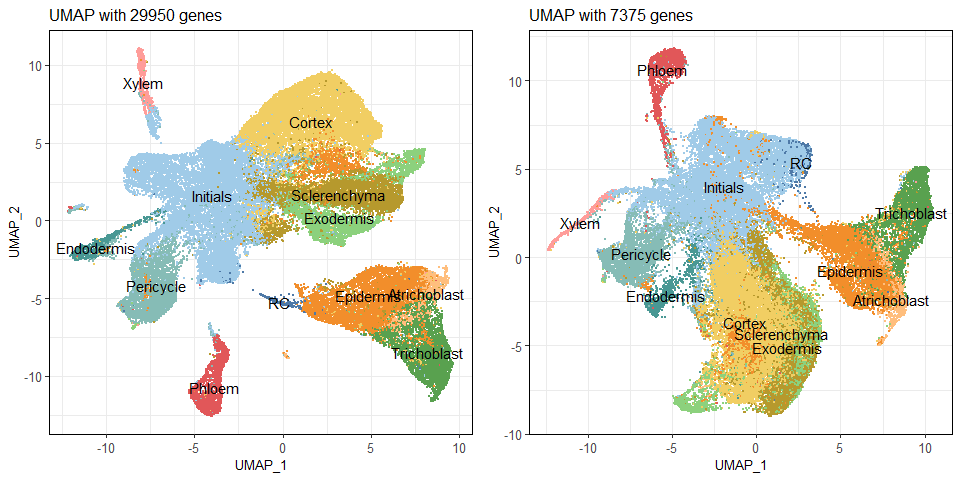<!-- -->

``` r
p1 <- DimPlot(merge_os_nema, group.by = "Cluster", label = TRUE) +
  theme_notebook + theme(legend.position = "none") +
  ggtitle("UMAP with 29950 genes")
p2 <- DimPlot(rice_subset, group.by = "Cluster", label = TRUE) +
  theme_notebook +
  ggtitle("UMAP with 7375 genes") + theme(legend.position = "none")

grid.arrange(p1, p2, ncol = 2)
```

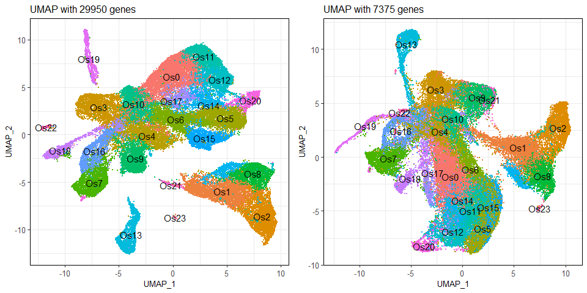<!-- -->

Repeat the procedure with arabiodpsis dataset

``` r
#### Preparing arabidopsis dataset
# Keep only RNA assay and delete metadata
DefaultAssay(merge_at_nema) <- "RNA"
ara_rna <- DietSeurat(merge_at_nema, assays = "RNA")
ara_rna@meta.data <- ara_rna@meta.data %>%
  select(-contains("SCT"))

# Filter genes that are one to one ortholog

# filter genes
genes_to_keep <- which(rownames(ara_rna@assays$RNA@counts) %in% one_to_one$ath_gene)
subset.ara <- ara_rna@assays$RNA@counts[genes_to_keep, ]

# Create new seurat object and add metadata
ara_subset <- CreateSeuratObject(subset.ara, orig.ident = "Arabidopsis_thaliana")
ara_subset@meta.data <- ara_rna@meta.data

# Checking clustering with only 5000 genes
ara_subset <- SCTransform(ara_subset)
```

    ## Calculating cell attributes from input UMI matrix: log_umi

    ## Variance stabilizing transformation of count matrix of size 7295 by 49747

    ## Model formula is y ~ log_umi

    ## Get Negative Binomial regression parameters per gene

    ## Using 2000 genes, 5000 cells

    ##   |                                                                              |                                                                      |   0%  |                                                                              |==================                                                    |  25%  |                                                                              |===================================                                   |  50%  |                                                                              |====================================================                  |  75%  |                                                                              |======================================================================| 100%

    ## Found 110 outliers - those will be ignored in fitting/regularization step

    ## Second step: Get residuals using fitted parameters for 7295 genes

    ##   |                                                                              |                                                                      |   0%  |                                                                              |=====                                                                 |   7%  |                                                                              |=========                                                             |  13%  |                                                                              |==============                                                        |  20%  |                                                                              |===================                                                   |  27%  |                                                                              |=======================                                               |  33%  |                                                                              |============================                                          |  40%  |                                                                              |=================================                                     |  47%  |                                                                              |=====================================                                 |  53%  |                                                                              |==========================================                            |  60%  |                                                                              |===============================================                       |  67%  |                                                                              |===================================================                   |  73%  |                                                                              |========================================================              |  80%  |                                                                              |=============================================================         |  87%  |                                                                              |=================================================================     |  93%  |                                                                              |======================================================================| 100%

    ## Computing corrected count matrix for 7295 genes

    ##   |                                                                              |                                                                      |   0%  |                                                                              |=====                                                                 |   7%  |                                                                              |=========                                                             |  13%  |                                                                              |==============                                                        |  20%  |                                                                              |===================                                                   |  27%  |                                                                              |=======================                                               |  33%  |                                                                              |============================                                          |  40%  |                                                                              |=================================                                     |  47%  |                                                                              |=====================================                                 |  53%  |                                                                              |==========================================                            |  60%  |                                                                              |===============================================                       |  67%  |                                                                              |===================================================                   |  73%  |                                                                              |========================================================              |  80%  |                                                                              |=============================================================         |  87%  |                                                                              |=================================================================     |  93%  |                                                                              |======================================================================| 100%

    ## Calculating gene attributes

    ## Wall clock passed: Time difference of 1.960013 mins

    ## Determine variable features

    ## Place corrected count matrix in counts slot

    ## Centering data matrix

    ## Set default assay to SCT

``` r
ara_subset <- RunPCA(ara_subset)
```

    ## PC_ 1 
    ## Positive:  AT1G20850, AT5G04200, AT5G16490, AT5G12870, AT2G28315, AT4G18780, AT3G21550, AT5G44030, AT1G47410, AT1G11190 
    ##     AT5G17420, AT5G03260, AT5G40020, AT3G62160, AT2G17710, AT3G53620, AT5G15630, AT5G60720, AT3G18660, AT2G37090 
    ##     AT1G24030, AT5G06610, AT5G42710, AT1G27440, AT2G14095, AT1G27920, AT5G01930, AT5G26330, AT1G02640, AT1G54790 
    ## Negative:  AT3G55440, AT3G09925, AT3G16240, AT1G51650, AT3G61110, AT5G13930, AT2G21045, AT2G37130, AT1G08830, AT3G52300 
    ##     AT4G31985, AT2G36530, AT1G07890, AT1G30870, AT4G25740, AT4G30190, AT4G37830, AT3G51240, AT3G01280, AT2G27510 
    ##     AT1G78570, AT1G73260, AT2G25810, AT2G20490, AT2G31490, AT3G10920, AT3G19820, AT3G23600, AT2G21160, AT1G79550 
    ## PC_ 2 
    ## Positive:  AT4G34050, AT5G66390, AT5G42180, AT3G11930, AT2G22860, AT5G15290, AT3G16240, AT1G61590, AT1G71740, AT5G16010 
    ##     AT5G57620, AT4G39700, AT3G23250, AT3G03990, AT4G02090, AT2G30490, AT1G02400, AT1G44970, AT5G17460, AT5G41040 
    ##     AT2G28305, AT3G10910, AT4G09890, AT4G06746, AT2G41430, AT2G32720, AT1G58340, AT5G48930, AT4G38620, AT1G23800 
    ## Negative:  AT5G04200, AT2G14095, AT5G23530, AT1G11190, AT2G38480, AT1G03070, AT4G20260, AT2G15220, AT5G57800, AT5G57510 
    ##     AT1G30700, AT1G12740, AT5G23210, AT4G39670, AT4G17500, AT2G15680, AT2G01275, AT3G05500, AT1G02860, AT3G14770 
    ##     AT2G21610, AT1G17620, AT4G17790, AT1G47510, AT3G24500, AT3G05890, AT4G17830, AT1G67850, AT2G04160, AT5G36880 
    ## PC_ 3 
    ## Positive:  AT1G20850, AT5G16490, AT5G12870, AT2G28315, AT4G18780, AT5G17420, AT5G44030, AT5G15630, AT1G47410, AT3G21550 
    ##     AT3G62160, AT3G18660, AT3G09925, AT2G37090, AT5G60720, AT5G26330, AT5G03260, AT5G42710, AT1G02640, AT5G40020 
    ##     AT1G24030, AT3G61110, AT5G06610, AT1G27920, AT1G27440, AT1G19300, AT1G30870, AT2G38320, AT1G51650, AT1G79620 
    ## Negative:  AT5G04200, AT2G14095, AT5G66390, AT5G23530, AT5G42180, AT4G34050, AT1G11190, AT5G15290, AT1G71740, AT1G61590 
    ##     AT4G20260, AT2G38480, AT1G03070, AT4G02090, AT3G28210, AT3G24500, AT5G57620, AT1G44970, AT3G05500, AT1G30700 
    ##     AT1G19020, AT2G15220, AT5G41040, AT5G57800, AT3G10910, AT3G11930, AT2G21620, AT2G28305, AT2G01275, AT5G16010 
    ## PC_ 4 
    ## Positive:  AT3G09925, AT5G66390, AT5G42180, AT1G30870, AT5G15290, AT1G71740, AT1G61590, AT4G02090, AT2G21045, AT1G44970 
    ##     AT2G37130, AT1G73580, AT5G57620, AT5G41040, AT3G10910, AT1G19910, AT4G30320, AT4G20260, AT1G03920, AT2G25810 
    ##     AT4G24130, AT4G37010, AT4G21105, AT3G23600, AT1G51650, AT4G37830, AT4G18930, AT5G59520, AT3G07880, AT3G52300 
    ## Negative:  AT3G11930, AT2G22860, AT4G39700, AT5G16010, AT3G23250, AT3G03990, AT4G34050, AT2G41430, AT1G58340, AT4G06746 
    ##     AT2G20490, AT3G57450, AT3G28210, AT1G68290, AT5G14180, AT5G08180, AT1G11580, AT2G42430, AT5G05220, AT2G31940 
    ##     AT5G46700, AT3G61110, AT2G39700, AT3G03920, AT3G26760, AT2G28790, AT2G30490, AT1G23800, AT2G36950, AT5G53120 
    ## PC_ 5 
    ## Positive:  AT3G09925, AT1G30870, AT3G11930, AT2G22860, AT3G16240, AT5G16010, AT4G39700, AT1G73580, AT2G21045, AT4G20260 
    ##     AT4G30320, AT2G37130, AT5G17460, AT3G03990, AT4G21105, AT4G34050, AT1G19910, AT3G23250, AT4G06746, AT4G37830 
    ##     AT1G72020, AT1G51650, AT1G10200, AT3G07880, AT5G04200, AT3G52730, AT3G52300, AT3G28210, AT5G28050, AT3G55440 
    ## Negative:  AT5G66390, AT5G42180, AT1G71740, AT5G15290, AT1G61590, AT4G02090, AT1G44970, AT1G03920, AT1G15330, AT3G10910 
    ##     AT5G41040, AT5G57620, AT4G24130, AT2G36950, AT5G13870, AT2G34590, AT2G20490, AT5G08180, AT3G61110, AT3G03920 
    ##     AT4G31290, AT2G28790, AT4G25740, AT3G21720, AT4G38690, AT2G12646, AT2G47810, AT1G12740, AT4G37870, AT4G24190

``` r
ara_subset <- RunUMAP(ara_subset, dims = 1:30)
```

    ## 22:16:55 UMAP embedding parameters a = 0.9922 b = 1.112

    ## Found more than one class "dist" in cache; using the first, from namespace 'spam'

    ## Also defined by 'BiocGenerics'

    ## 22:16:55 Read 49747 rows and found 30 numeric columns

    ## 22:16:55 Using Annoy for neighbor search, n_neighbors = 30

    ## Found more than one class "dist" in cache; using the first, from namespace 'spam'

    ## Also defined by 'BiocGenerics'

    ## 22:16:55 Building Annoy index with metric = cosine, n_trees = 50

    ## 0%   10   20   30   40   50   60   70   80   90   100%

    ## [----|----|----|----|----|----|----|----|----|----|

    ## **************************************************|
    ## 22:17:00 Writing NN index file to temp file C:\Users\teima\AppData\Local\Temp\RtmpkdIrQx\file41447f5b3ccb
    ## 22:17:01 Searching Annoy index using 1 thread, search_k = 3000
    ## 22:17:14 Annoy recall = 100%
    ## 22:17:15 Commencing smooth kNN distance calibration using 1 thread with target n_neighbors = 30
    ## 22:17:18 Initializing from normalized Laplacian + noise (using irlba)
    ## 22:17:20 Commencing optimization for 200 epochs, with 2228186 positive edges
    ## 22:18:03 Optimization finished

``` r
# N genes all dataset
dim(merge_at_nema@assays$SCT@counts)
```

    ## [1] 23652 49747

``` r
# N genes subset dataset
dim(ara_subset@assays$SCT@counts)
```

    ## [1]  7295 49747

``` r
# Check structure data after subsetting
p1 <- DimPlot(merge_at_nema, group.by = "Cell_type", label = TRUE) +
  theme_notebook +
  scale_colour_tableau(palette = "Tableau 20") + theme(legend.position = "none") +
  ggtitle("UMAP with 23652 genes")
p2 <- DimPlot(ara_subset, group.by = "Cell_type", label = TRUE) +
  theme_notebook +
  scale_colour_tableau(palette = "Tableau 20") +
  ggtitle("UMAP with 7295 genes") + theme(legend.position = "none")

grid.arrange(p1, p2, ncol = 2)
```

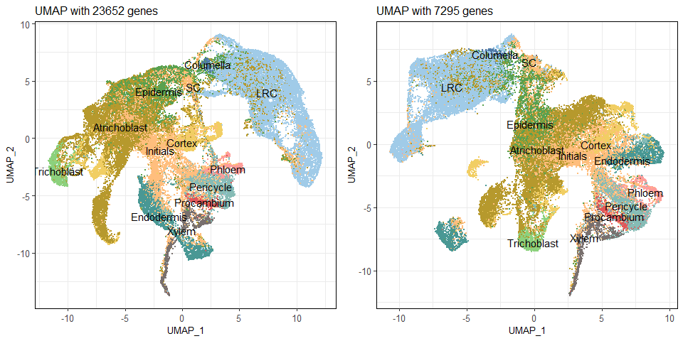<!-- -->

``` r
# Check structure data after subsetting
p1 <- DimPlot(merge_at_nema, group.by = "Cluster", label = TRUE) +
  theme_notebook + theme(legend.position = "none") +
  ggtitle("UMAP with 23652 genes")
p2 <- DimPlot(ara_subset, group.by = "Cluster", label = TRUE) +
  theme_notebook +
  ggtitle("UMAP with 7295 genes") + theme(legend.position = "none")

grid.arrange(p1, p2, ncol = 2)
```

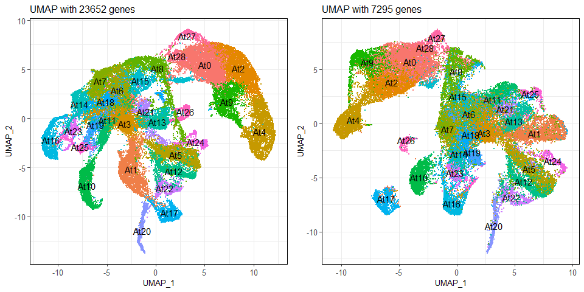<!-- -->

``` r
# Code for running the integration, as some problems running in the notebook,
# it was run in another session and the object was saved for further analysis

seur_list<-list(rice_subset,ara_subset)

features <- SelectIntegrationFeatures(object.list = seur_list,
                                      nfeatures = 3000)
seur_list <- PrepSCTIntegration(object.list = seur_list,
                                anchor.features = features)


specie.anchors <- FindIntegrationAnchors(object.list = seur_list,
                                         normalization.method = "SCT",
                                         anchor.features = features)
specie.combined.sct <- IntegrateData(anchorset = specie.anchors,
                                     normalization.method = "SCT")
saveRDS(specie.combined.sct, SPECIE_DATA_PATH)
```

``` r
#Run clustering in the integrated dataset
specie.combined.sct <- RunPCA(specie.combined.sct, verbose = FALSE)
specie.combined.sct <- RunUMAP(specie.combined.sct, reduction = "pca", dims = 1:40)
```

    ## 22:20:19 UMAP embedding parameters a = 0.9922 b = 1.112

    ## Found more than one class "dist" in cache; using the first, from namespace 'spam'

    ## Also defined by 'BiocGenerics'

    ## 22:20:19 Read 106158 rows and found 40 numeric columns

    ## 22:20:19 Using Annoy for neighbor search, n_neighbors = 30

    ## Found more than one class "dist" in cache; using the first, from namespace 'spam'

    ## Also defined by 'BiocGenerics'

    ## 22:20:19 Building Annoy index with metric = cosine, n_trees = 50

    ## 0%   10   20   30   40   50   60   70   80   90   100%

    ## [----|----|----|----|----|----|----|----|----|----|

    ## **************************************************|
    ## 22:20:33 Writing NN index file to temp file C:\Users\teima\AppData\Local\Temp\RtmpkdIrQx\file41444752e5
    ## 22:20:33 Searching Annoy index using 1 thread, search_k = 3000
    ## 22:21:07 Annoy recall = 100%
    ## 22:21:07 Commencing smooth kNN distance calibration using 1 thread with target n_neighbors = 30
    ## 22:21:12 Initializing from normalized Laplacian + noise (using irlba)
    ## 22:21:19 Commencing optimization for 200 epochs, with 4787172 positive edges
    ## 22:22:51 Optimization finished

``` r
specie.combined.sct <- FindNeighbors(specie.combined.sct,dims = 1:40, verbose = FALSE,reduction="pca")
specie.combined.sct <-FindClusters(specie.combined.sct,resolution=seq(0.2,1,0.1))
```

    ## Modularity Optimizer version 1.3.0 by Ludo Waltman and Nees Jan van Eck
    ## 
    ## Number of nodes: 106158
    ## Number of edges: 3671009
    ## 
    ## Running Louvain algorithm...
    ## Maximum modularity in 10 random starts: 0.9341
    ## Number of communities: 12
    ## Elapsed time: 23 seconds

    ## 1 singletons identified. 11 final clusters.

    ## Modularity Optimizer version 1.3.0 by Ludo Waltman and Nees Jan van Eck
    ## 
    ## Number of nodes: 106158
    ## Number of edges: 3671009
    ## 
    ## Running Louvain algorithm...
    ## Maximum modularity in 10 random starts: 0.9253
    ## Number of communities: 17
    ## Elapsed time: 24 seconds

    ## 1 singletons identified. 16 final clusters.

    ## Modularity Optimizer version 1.3.0 by Ludo Waltman and Nees Jan van Eck
    ## 
    ## Number of nodes: 106158
    ## Number of edges: 3671009
    ## 
    ## Running Louvain algorithm...
    ## Maximum modularity in 10 random starts: 0.9192
    ## Number of communities: 20
    ## Elapsed time: 23 seconds

    ## 1 singletons identified. 19 final clusters.

    ## Modularity Optimizer version 1.3.0 by Ludo Waltman and Nees Jan van Eck
    ## 
    ## Number of nodes: 106158
    ## Number of edges: 3671009
    ## 
    ## Running Louvain algorithm...
    ## Maximum modularity in 10 random starts: 0.9128
    ## Number of communities: 27
    ## Elapsed time: 21 seconds

    ## 1 singletons identified. 26 final clusters.

    ## Modularity Optimizer version 1.3.0 by Ludo Waltman and Nees Jan van Eck
    ## 
    ## Number of nodes: 106158
    ## Number of edges: 3671009
    ## 
    ## Running Louvain algorithm...
    ## Maximum modularity in 10 random starts: 0.9071
    ## Number of communities: 27
    ## Elapsed time: 22 seconds

    ## 1 singletons identified. 26 final clusters.

    ## Modularity Optimizer version 1.3.0 by Ludo Waltman and Nees Jan van Eck
    ## 
    ## Number of nodes: 106158
    ## Number of edges: 3671009
    ## 
    ## Running Louvain algorithm...
    ## Maximum modularity in 10 random starts: 0.9030
    ## Number of communities: 33
    ## Elapsed time: 21 seconds

    ## 1 singletons identified. 32 final clusters.

    ## Modularity Optimizer version 1.3.0 by Ludo Waltman and Nees Jan van Eck
    ## 
    ## Number of nodes: 106158
    ## Number of edges: 3671009
    ## 
    ## Running Louvain algorithm...
    ## Maximum modularity in 10 random starts: 0.8992
    ## Number of communities: 36
    ## Elapsed time: 22 seconds

    ## 1 singletons identified. 35 final clusters.

    ## Modularity Optimizer version 1.3.0 by Ludo Waltman and Nees Jan van Eck
    ## 
    ## Number of nodes: 106158
    ## Number of edges: 3671009
    ## 
    ## Running Louvain algorithm...
    ## Maximum modularity in 10 random starts: 0.8955
    ## Number of communities: 37
    ## Elapsed time: 21 seconds

    ## 1 singletons identified. 36 final clusters.

    ## Modularity Optimizer version 1.3.0 by Ludo Waltman and Nees Jan van Eck
    ## 
    ## Number of nodes: 106158
    ## Number of edges: 3671009
    ## 
    ## Running Louvain algorithm...
    ## Maximum modularity in 10 random starts: 0.8924
    ## Number of communities: 38
    ## Elapsed time: 21 seconds

    ## 1 singletons identified. 37 final clusters.

``` r
clustree(specie.combined.sct, prefix = "integrated_snn_res.")
```

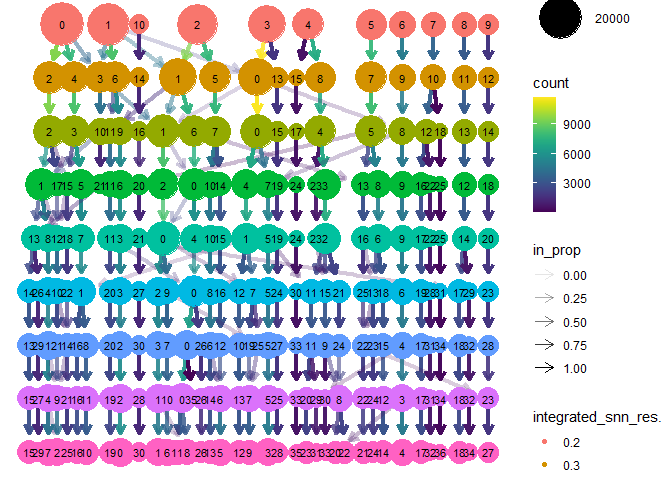<!-- -->

``` r
specie.combined.sct@meta.data<- specie.combined.sct@meta.data %>% 
  mutate(Cluster_int = paste0("Int",integrated_snn_res.0.4))
Clusters <- mixedsort(as.character(unique(specie.combined.sct@meta.data$Cluster_int)))#relevel clusters by name
specie.combined.sct@meta.data<- specie.combined.sct@meta.data %>% 
   mutate(Cluster_int= fct_relevel(Cluster_int, Clusters))
umap_species <- Embeddings(object = specie.combined.sct[["umap"]])[, 1:2]
umap_species <-umap_species %>% cbind(specie.combined.sct@meta.data)
label.df <- data.frame(Cluster_int=levels(umap_species$Cluster_int),label=paste0(levels(umap_species$Cluster_int)))
label.df_2 <- umap_species %>% 
  group_by(Cluster_int) %>% 
  summarize(UMAP_1 = mean(UMAP_1), UMAP_2 = median(UMAP_2)) %>% 
  left_join(label.df)
```

    ## Joining with `by = join_by(Cluster_int)`

``` r
species_umap_plot <-ggplot(umap_species,aes(x=UMAP_1,y=UMAP_2,color=Cluster_int))+geom_point(size=1,
                                                                                       shape=18,stroke=0)+
  geom_label(size=(10*5/14),data=label.df_2,aes(x=UMAP_1,y=UMAP_2,label=Cluster_int),color="black",label.padding = unit(0.05, "lines"),label.r = unit(0.05, "lines"),label.size = 0.1)+
  scale_color_manual(values=cols_umap)+theme_bw()+theme_void()+theme(legend.position = "none")
```

``` r
species_umap_plot 
```

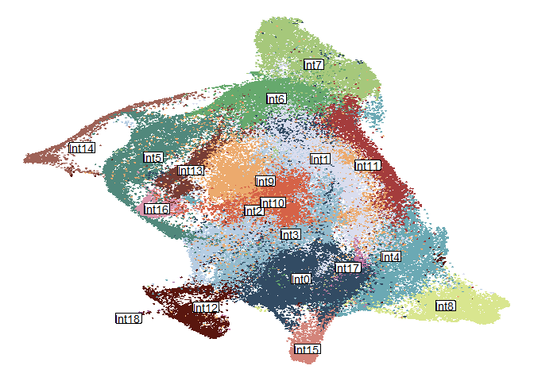<!-- -->

``` r
species_nema_plot<-ggplot()+
  geom_point(data=umap_species[umap_species$Nema_cluster == "Other",],aes(x=UMAP_1,y=UMAP_2),
             size=0.3,shape=18,stroke=0,color="grey80")+
  geom_point(data=umap_species[umap_species$Nema_cluster != "Other",],
             aes(x=UMAP_1,y=UMAP_2,color=Nema_cluster),
             size=0.3,shape=18,stroke=0)+
  scale_color_manual(values=cols_nema_combined)+theme_bw()+theme_void()+theme(legend.position = "none")
```

``` r
species_nema_plot
```

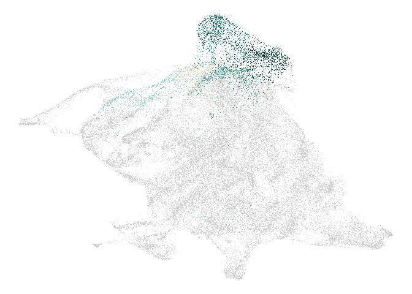<!-- -->

``` r
species_cluster <- ggplot(data=umap_species, aes(x=Cluster_int, fill=factor(specie))) +
  geom_bar(position="fill")+
  scale_fill_manual(values=cols_specie)+
  theme_classic()+
  geom_hline(yintercept=0.53,linetype = "dashed",linewidth=0.1)+
  ylab("Frequency")+
  #theme_paper+
  theme_notebook+
  xlab("Cluster")+
  coord_flip()
```

``` r
species_cluster
```

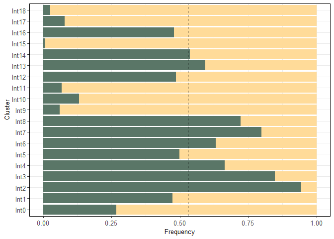<!-- -->

``` r
#Stats of cluster frequency

treatment_nema <- specie.combined.sct@meta.data%>% 
  select(Cell_type,Treatment,Cluster_int)


test <- chisq.test(table(treatment_nema$Cluster_int,treatment_nema$Treatment))
df<-table(treatment_nema$Cluster_int,treatment_nema$Treatment)
df1 <- cbind(df, t(apply(df, 1, function(x) {
  ch <- chisq.test(x,p = c(0.716,0.284))
  c(unname(ch$statistic), ch$p.value,ch$expected)})))
colnames(df1) <- c("Mock_obs","Inf_obs",'xsquared', 'pvalue',"Mock_exp", "Inf_exp")
df1<-df1 %>% as.data.frame() %>% mutate(freq=(Inf_obs/Mock_obs),
                                        freq_fold=(Inf_obs/Mock_obs)/0.284) %>% 
  arrange((freq_fold))
df1
```

    ##       Mock_obs Inf_obs   xsquared        pvalue Mock_exp  Inf_exp      freq
    ## Int6      7020    1049   941.0416 1.175134e-206 5777.404 2291.596 0.1494302
    ## Int7      6418    1554   311.0117  1.314704e-69 5707.952 2264.048 0.2421315
    ## Int2      6328    3332   176.3490  3.038270e-40 6916.560 2743.440 0.5265487
    ## Int13     2094    1344   193.3004  6.052913e-44 2461.608  976.392 0.6418338
    ## Int5      4279    3881  1473.3556 2.420922e-322 5842.560 2317.440 0.9069876
    ## Int1      5281    5308  2458.3445  0.000000e+00 7581.724 3007.276 1.0051127
    ## Int14      883    1004   571.0303 3.351142e-126 1351.092  535.908 1.1370328
    ## Int3      3917    4593  2736.6592  0.000000e+00 6093.160 2416.840 1.1725811
    ## Int0      5072    6615  4571.0033  0.000000e+00 8367.892 3319.108 1.3042192
    ## Int16      444     901   984.9508 3.353072e-216  963.020  381.980 2.0292793
    ## Int12     1198    2551  2897.7226  0.000000e+00 2684.284 1064.716 2.1293823
    ## Int15      482    1376  1904.8050  0.000000e+00 1330.328  527.672 2.8547718
    ## Int10     1139    3353  4724.0624  0.000000e+00 3216.272 1275.728 2.9438104
    ## Int18       69     229   343.9492  8.807002e-77  213.368   84.632 3.3188406
    ## Int17      123     495   812.2491 1.171929e-178  442.488  175.512 4.0243902
    ## Int8      1125    4597  7591.0939  0.000000e+00 4096.952 1625.048 4.0862222
    ## Int9      1113    4561  7540.5121  0.000000e+00 4062.584 1611.416 4.0979335
    ## Int4      1491    6722 11537.1491  0.000000e+00 5880.508 2332.492 4.5083836
    ## Int11      757    3460  5968.8831  0.000000e+00 3019.372 1197.628 4.5706737
    ##        freq_fold
    ## Int6   0.5261627
    ## Int7   0.8525757
    ## Int2   1.8540446
    ## Int13  2.2599782
    ## Int5   3.1936184
    ## Int1   3.5391291
    ## Int14  4.0036368
    ## Int3   4.1288065
    ## Int0   4.5923213
    ## Int16  7.1453496
    ## Int12  7.4978250
    ## Int15 10.0520133
    ## Int10 10.3655294
    ## Int18 11.6860584
    ## Int17 14.1703882
    ## Int8  14.3881064
    ## Int9  14.4293434
    ## Int4  15.8745903
    ## Int11 16.0939215

``` r
umap_species<- umap_species %>% 
  mutate(Treatment = fct_relevel(Treatment,c("Mock","Infected"))) %>% 
  mutate(Cluster_int=fct_relevel(Cluster_int, rownames(df1)))
species_cluster_treat <- ggplot(data=umap_species, aes(x=Cluster_int, fill=factor(Treatment))) +
  geom_bar(position="fill")+
  scale_fill_manual(values=cols_treat)+
  theme_classic()+
  geom_hline(yintercept=0.46,linetype = "dashed",linewidth=0.1)+
  ylab("Frequency")+
  theme_paper+
  xlab("Cluster")+
  coord_flip()
#ggsave(species_cluster_treat,file=file.path("Figures_paper","07_Species_integration","species_cluster_treat.pdf"), width=3.2, height=5.7, units="cm", dpi=1000)
```

``` r
species_cluster_treat
```

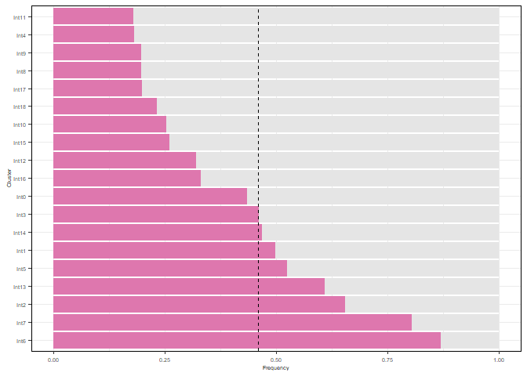<!-- -->

``` r
cells_sankey <- specie.combined.sct@meta.data %>% 
  filter(!Nema_cluster == "Other" | Cluster_int %in% c("Int6","Int7"))
cells_sankey <- cells_sankey %>% 
  mutate(Original_cluster =  case_when((Nema_cluster == "Other" & specie == "Arabidopsis thaliana") ~ "ath_Other",
                                       (Nema_cluster == "Other" & specie == "Oryza sativa") ~ "osa_Other",
                                       TRUE ~ Nema_cluster),
         Integrated_cluster = case_when(!Cluster_int %in% c("Int6","Int7") ~ "Other",
                                        TRUE ~ Cluster_int)) %>% 
  select(Original_cluster,Integrated_cluster)
#paper
cells_sankey_plot <- cells_sankey %>% 
  make_long(Original_cluster,Integrated_cluster)

cells_sankey_plot$node <- factor(cells_sankey_plot$node,levels = c("osa_Other","Os3","Os9","Os10","Os16","Os17",
                                                                   "At8","At28","ath_Other","Int7","Int6","Other"))
cells_sankey_plot$next_node <- factor(cells_sankey_plot$next_node,levels = c("osa_Other","Os3","Os9","Os10","Os16","Os17",
                                                                   "At8","At28","ath_Other","Int7","Int6","Other"))


sankey <- ggplot(cells_sankey_plot, aes(x = x, 
                                        next_x = next_x, 
                                        node = node, 
                                        next_node = next_node,
                                        fill = factor(node),
                                        label=node)) +
  geom_sankey() +
  geom_sankey(flow.alpha = 0.5, node.color = 1) +
  geom_sankey_text(size = (5*5/14), color = "black", hjust = 0, position = position_nudge(x = 0.08))+
  scale_fill_manual(values=cols_sankey) +
  theme_void()+
  theme(legend.position = "none")
```

``` r
sankey
```

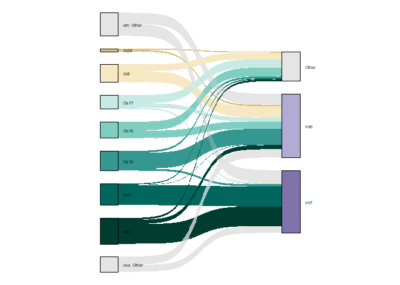<!-- -->

``` r
#Plots of percentage cells per cluster
cells_stats <- cells_sankey %>% 
  filter(!Original_cluster %in% c("ath_Other","osa_Other")) %>% 
  mutate(Original_cluster = factor(Original_cluster, levels = c("At28","At8","Os17","Os16","Os10","Os9","Os3"))) %>% 
  mutate(Integrated_cluster = factor(Integrated_cluster, levels = c("Int7","Int6","Other")))
cells_summarize <- cells_stats %>% 
  count(Original_cluster,Integrated_cluster) %>% 
  group_by(Original_cluster) %>% 
  mutate(pct = n / sum(n)) 

cells_stats_plots<-ggplot(cells_summarize, aes(x =Integrated_cluster, y = pct, fill = Integrated_cluster)) +
  geom_col(position = "dodge",width = 0.5) +
  facet_grid(Original_cluster ~ .,switch = "y" ) +
  geom_text(aes(label = paste0(round(pct*100,digits = 0),"%"),
                y= pct+0.05),size=(4*5/14))+
  scale_fill_manual(values = cols_sankey)+
  #theme_strip+
  theme_notebook+
  theme(axis.title.y = element_blank(),
        axis.ticks.y = element_blank(),
        axis.text=element_blank(),
        panel.border = element_blank(),
        axis.title.x = element_blank(),
        axis.ticks.x = element_blank(),
        panel.spacing = unit(0.1, "lines"),
        strip.text.y = element_text(margin = margin(2,0.02,2,0.02, "cm")))+
  coord_flip()
```

``` r
cells_stats_plots
```

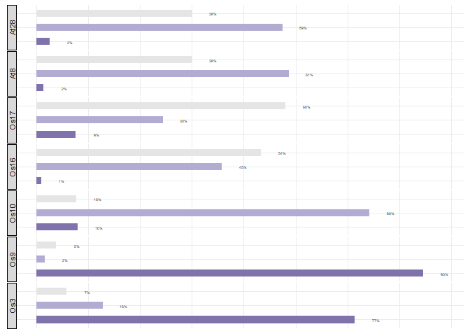<!-- -->

``` r
data_clusters <- specie.combined.sct@meta.data

tab <- with(data_clusters, table(Cluster_int, Cluster))

freq_orig <- prop.table(tab, margin = 2)*100


# Define the palette length
paletteLength <- 50

# Create the color palette using RdBu from RColorBrewer
myColor <- (colorRampPalette(brewer.pal(11, "PuOr")[6:11]))(paletteLength)

# Create the breaks, ensuring the colors are centered around 0
myBreaks <- c(seq(-max(freq_orig), 0, length.out=ceiling(paletteLength/2) + 1), 
              seq(max(freq_orig)/paletteLength, max(freq_orig), length.out=floor(paletteLength/2)))
ann_column = data.frame(Cluster= unique(data_clusters$Cluster))
rownames(ann_column)<-unique(data_clusters$Cluster)
ann_column <- ann_column %>% 
  mutate(Cluster_color = case_when(Cluster %in% c("Os3", "Os9","Os10","Os16","Os17",
                                                  "At8","At28") ~ Cluster,
                                   TRUE ~ "Other")) %>% select(Cluster_color)
ann_colors = list(
  Cluster_color = cols_nema_combined)


heat_freq <- pheatmap(t(freq_orig), cluster_cols = FALSE,
                      color=myColor, breaks = c(seq(0,100,2)),
                      annotation_row = ann_column,
                      annotation_colors=ann_colors,
                      treeheight_row=0,treeheight_col=0,fontsize=5, 
                      annotation_legend = FALSE,
                      annotation_names_col = FALSE,
                      annotation_names_row = FALSE,border_color=NA,legend = TRUE,show_rownames=TRUE,
                      show_colnames=TRUE, angle_col = 90)
```

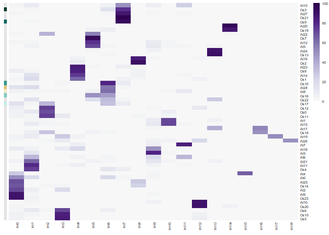<!-- -->

``` r
DimPlot(specie.combined.sct, group.by = "specie", shuffle = TRUE)+
  scale_color_manual(values=cols_specie)
```

    ## Rasterizing points since number of points exceeds 100,000.
    ## To disable this behavior set `raster=FALSE`

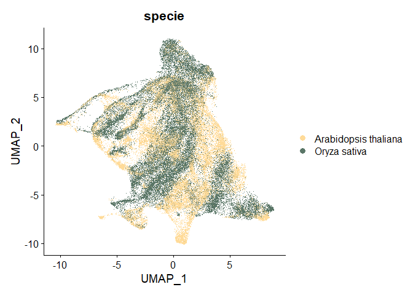<!-- -->

``` r
DimPlot(specie.combined.sct, group.by = "orig.ident", shuffle = TRUE)
```

    ## Rasterizing points since number of points exceeds 100,000.
    ## To disable this behavior set `raster=FALSE`

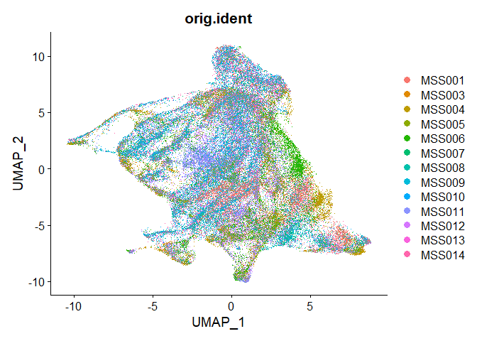<!-- -->

``` r
DimPlot(specie.combined.sct, group.by = "Treatment", shuffle = TRUE)+
  scale_color_manual(values=cols_treat)
```

    ## Rasterizing points since number of points exceeds 100,000.
    ## To disable this behavior set `raster=FALSE`

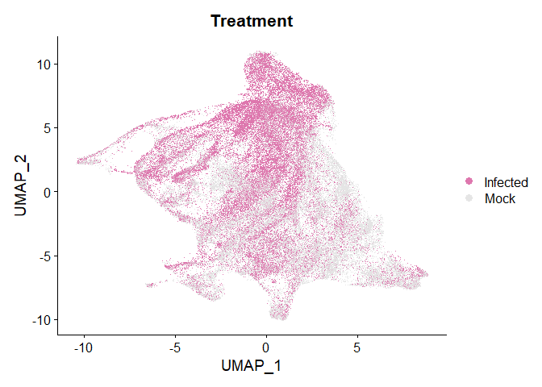<!-- -->

``` r
specie.combined.sct@meta.data <-  specie.combined.sct@meta.data %>% 
  mutate(Sp_tr = paste0(specie,"_",Treatment))
```

``` r
DimPlot(specie.combined.sct, group.by = "Sp_tr", shuffle = TRUE)
```

    ## Rasterizing points since number of points exceeds 100,000.
    ## To disable this behavior set `raster=FALSE`

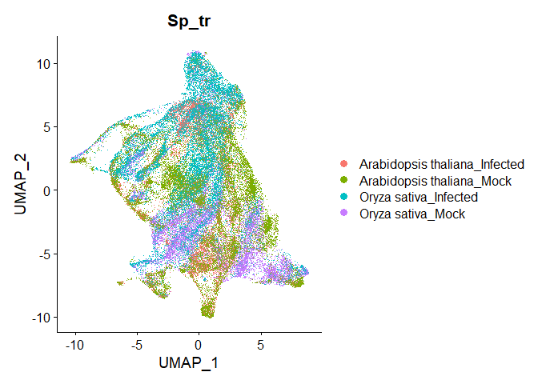<!-- -->

``` r
sessionInfo()
```

    ## R version 4.2.1 (2022-06-23 ucrt)
    ## Platform: x86_64-w64-mingw32/x64 (64-bit)
    ## Running under: Windows 10 x64 (build 19045)
    ## 
    ## Matrix products: default
    ## 
    ## locale:
    ## [1] LC_COLLATE=Spanish_Spain.utf8  LC_CTYPE=Spanish_Spain.utf8   
    ## [3] LC_MONETARY=Spanish_Spain.utf8 LC_NUMERIC=C                  
    ## [5] LC_TIME=Spanish_Spain.utf8    
    ## 
    ## attached base packages:
    ##  [1] tools     stats4    grid      stats     graphics  grDevices utils    
    ##  [8] datasets  methods   base     
    ## 
    ## other attached packages:
    ##  [1] slingshot_2.4.0             TrajectoryUtils_1.4.0      
    ##  [3] princurve_2.1.6             lisi_1.0                   
    ##  [5] harmony_1.1.0               scater_1.26.1              
    ##  [7] scuttle_1.6.3               ggVennDiagram_1.5.2        
    ##  [9] igraph_2.0.1.1              muscatWrapper_1.0.0        
    ## [11] xlsx_0.6.5                  edgeR_3.38.4               
    ## [13] limma_3.52.4                SingleCellExperiment_1.18.1
    ## [15] muscat_1.10.1               ggpubr_0.6.0               
    ## [17] corto_1.2.2                 ggh4x_0.2.8                
    ## [19] ggrepel_0.9.4               rrvgo_1.8.0                
    ## [21] ontologyIndex_2.11          pheatmap_1.0.12            
    ## [23] ggsankey_0.0.99999          future_1.33.0              
    ## [25] ggthemes_4.2.4              lubridate_1.9.3            
    ## [27] dplyr_1.1.3                 purrr_1.0.2                
    ## [29] readr_2.1.2                 tidyr_1.3.1                
    ## [31] tibble_3.2.1                tidyverse_2.0.0            
    ## [33] scales_1.3.0                RColorBrewer_1.1-3         
    ## [35] rhdf5_2.40.0                SummarizedExperiment_1.26.1
    ## [37] Biobase_2.56.0              MatrixGenerics_1.8.1       
    ## [39] Rcpp_1.0.11                 Matrix_1.6-1               
    ## [41] GenomicRanges_1.48.0        GenomeInfoDb_1.32.4        
    ## [43] IRanges_2.30.1              S4Vectors_0.34.0           
    ## [45] BiocGenerics_0.44.0         matrixStats_1.1.0          
    ## [47] data.table_1.14.8           stringr_1.5.1              
    ## [49] plyr_1.8.9                  magrittr_2.0.3             
    ## [51] gtable_0.3.5                ArchR_1.0.2                
    ## [53] gtools_3.9.4                clustree_0.5.1             
    ## [55] ggraph_2.1.0                ggcorrplot_0.1.4.1         
    ## [57] gridExtra_2.3               patchwork_1.1.3            
    ## [59] forcats_1.0.0               rlang_1.1.2                
    ## [61] SeuratObject_5.0.0          Seurat_4.4.0               
    ## [63] ggplot2_3.4.4              
    ## 
    ## loaded via a namespace (and not attached):
    ##   [1] rsvd_1.0.5                ica_1.0-3                
    ##   [3] foreach_1.5.2             lmtest_0.9-40            
    ##   [5] crayon_1.5.2              rbibutils_2.2.16         
    ##   [7] MASS_7.3-58.1             rhdf5filters_1.8.0       
    ##   [9] nlme_3.1-159              backports_1.4.1          
    ##  [11] sva_3.46.0                GOSemSim_2.22.0          
    ##  [13] XVector_0.36.0            ROCR_1.0-11              
    ##  [15] irlba_2.3.5.1             nloptr_2.0.3             
    ##  [17] BiocParallel_1.30.4       rjson_0.2.21             
    ##  [19] bit64_4.0.5               glue_1.6.2               
    ##  [21] sctransform_0.4.1         pbkrtest_0.5.2           
    ##  [23] parallel_4.2.1            vipor_0.4.5              
    ##  [25] spatstat.sparse_3.0-3     AnnotationDbi_1.60.0     
    ##  [27] dotCall64_1.1-0           spatstat.geom_3.2-7      
    ##  [29] tidyselect_1.2.0          fitdistrplus_1.1-11      
    ##  [31] variancePartition_1.28.0  XML_3.99-0.15            
    ##  [33] zoo_1.8-12                xtable_1.8-4             
    ##  [35] evaluate_0.23             Rdpack_2.6               
    ##  [37] cli_3.6.1                 zlibbioc_1.42.0          
    ##  [39] rstudioapi_0.15.0         miniUI_0.1.1.1           
    ##  [41] sp_2.1-3                  aod_1.3.2                
    ##  [43] wordcloud_2.6             locfdr_1.1-8             
    ##  [45] shiny_1.8.0               BiocSingular_1.12.0      
    ##  [47] xfun_0.41                 tm_0.7-15                
    ##  [49] clue_0.3-65               cluster_2.1.4            
    ##  [51] caTools_1.18.2            tidygraph_1.3.0          
    ##  [53] KEGGREST_1.38.0           listenv_0.9.0            
    ##  [55] xlsxjars_0.6.1            Biostrings_2.64.1        
    ##  [57] png_0.1-8                 withr_3.0.1              
    ##  [59] bitops_1.0-7              slam_0.1-50              
    ##  [61] ggforce_0.4.1             dqrng_0.3.1              
    ##  [63] pillar_1.9.0              gplots_3.1.3             
    ##  [65] GlobalOptions_0.1.2       cachem_1.0.8             
    ##  [67] multcomp_1.4-25           NLP_0.3-2                
    ##  [69] GetoptLong_1.0.5          DelayedMatrixStats_1.20.0
    ##  [71] vctrs_0.6.4               ellipsis_0.3.2           
    ##  [73] generics_0.1.3            beeswarm_0.4.0           
    ##  [75] munsell_0.5.1             tweenr_2.0.2             
    ##  [77] emmeans_1.8.9             DelayedArray_0.22.0      
    ##  [79] fastmap_1.1.1             compiler_4.2.1           
    ##  [81] abind_1.4-5               httpuv_1.6.12            
    ##  [83] rJava_1.0-6               plotly_4.10.3            
    ##  [85] GenomeInfoDbData_1.2.9    glmmTMB_1.1.8            
    ##  [87] lattice_0.20-45           deldir_1.0-9             
    ##  [89] utf8_1.2.4                later_1.3.1              
    ##  [91] jsonlite_1.8.8            ScaledMatrix_1.6.0       
    ##  [93] pbapply_1.7-2             carData_3.0-5            
    ##  [95] sparseMatrixStats_1.8.0   estimability_1.4.1       
    ##  [97] genefilter_1.78.0         lazyeval_0.2.2           
    ##  [99] promises_1.2.1            car_3.1-2                
    ## [101] doParallel_1.0.17         goftest_1.2-3            
    ## [103] checkmate_2.3.0           spatstat.utils_3.1-0     
    ## [105] reticulate_1.34.0         rmarkdown_2.25           
    ## [107] sandwich_3.0-2            cowplot_1.1.1            
    ## [109] blme_1.0-5                statmod_1.5.0            
    ## [111] Rtsne_0.16                uwot_0.1.16              
    ## [113] treemap_2.4-4             survival_3.4-0           
    ## [115] numDeriv_2016.8-1.1       yaml_2.3.7               
    ## [117] plotrix_3.8-4             htmltools_0.5.7          
    ## [119] memoise_2.0.1             locfit_1.5-9.8           
    ## [121] graphlayouts_1.1.0        viridisLite_0.4.2        
    ## [123] RhpcBLASctl_0.23-42       digest_0.6.33            
    ## [125] mime_0.12                 spam_2.10-0              
    ## [127] RSQLite_2.3.3             future.apply_1.11.0      
    ## [129] blob_1.2.4                labeling_0.4.3           
    ## [131] splines_4.2.1             Rhdf5lib_1.18.2          
    ## [133] RCurl_1.98-1.13           broom_1.0.5              
    ## [135] hms_1.1.3                 colorspace_2.1-0         
    ## [137] ggbeeswarm_0.7.2          shape_1.4.6              
    ## [139] RANN_2.6.1                mvtnorm_1.2-3            
    ## [141] circlize_0.4.15           fansi_1.0.5              
    ## [143] tzdb_0.3.0                parallelly_1.36.0        
    ## [145] R6_2.5.1                  ggridges_0.5.4           
    ## [147] lifecycle_1.0.4           bluster_1.8.0            
    ## [149] ggsignif_0.6.4            minqa_1.2.6              
    ## [151] leiden_0.4.3              RcppAnnoy_0.0.21         
    ## [153] TH.data_1.1-2             iterators_1.0.14         
    ## [155] spatstat.explore_3.2-5    TMB_1.9.6                
    ## [157] htmlwidgets_1.6.2         beachmat_2.12.0          
    ## [159] polyclip_1.10-6           timechange_0.2.0         
    ## [161] ComplexHeatmap_2.14.0     mgcv_1.8-40              
    ## [163] globals_0.16.2            spatstat.random_3.2-1    
    ## [165] progressr_0.14.0          codetools_0.2-18         
    ## [167] metapod_1.6.0             GO.db_3.15.0             
    ## [169] prettyunits_1.2.0         gridBase_0.4-7           
    ## [171] DBI_1.1.3                 highr_0.10               
    ## [173] tensor_1.5                httr_1.4.7               
    ## [175] KernSmooth_2.23-20        stringi_1.8.1            
    ## [177] progress_1.2.3            reshape2_1.4.4           
    ## [179] farver_2.1.1              annotate_1.76.0          
    ## [181] viridis_0.6.5             xml2_1.3.5               
    ## [183] boot_1.3-28               BiocNeighbors_1.14.0     
    ## [185] lme4_1.1-35.1             geneplotter_1.76.0       
    ## [187] scattermore_1.2           scran_1.26.0             
    ## [189] DESeq2_1.36.0             bit_4.0.5                
    ## [191] spatstat.data_3.0-3       pkgconfig_2.0.3          
    ## [193] lmerTest_3.1-3            rstatix_0.7.2            
    ## [195] knitr_1.45
